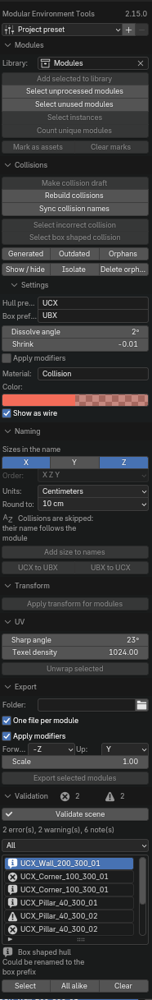

# Modular Environment Tools

Инструмент для сборки модульного окружения под движок. Держит библиотеку
уникальных модулей, делает черновые коллизии в конвенции Unreal, приводит имена
в порядок и проверяет сцену перед выгрузкой.

!!! info ""
    Автор — **Кирилл Харичев**, лицензия GPL-3.0-or-later. Студия ведёт свою
    ветку с доработками и возвращает их автору; документация описывает именно
    её. Оригинал живёт [здесь](https://github.com/HarichevK/Modular-environment-tools),
    студийная ветка — [здесь](https://github.com/Mutaform/Modular-environment-tools/tree/studio/rework).

{ .screenshot }

Как поставить аддон — на отдельной странице:
**[Установка](install.md)**.

## Как открыть панель

**++ctrl+shift+m++** во вьюпорте — панель всплывает под курсором.

Это основной способ: инструмент задуман так, чтобы не занимать место на экране
постоянно. Сочетание меняется в настройках аддона.

!!! tip "Если попап неудобен"
    В настройках аддона есть галочка **Show in the sidebar**. С ней в боковой
    панели 3D-вьюпорта появляется вкладка **Modular** с тем же содержимым.
    Выключенная вкладка ничего не ломает: сочетание клавиш продолжает работать.

## Главная идея: библиотека модулей

Аддон исходит из того, что модульный набор устроен так: в сцене лежит
коллекция уникальных мешей — **библиотека**, — а всё остальное расставлено
инстансами, то есть объектами, которые делят одни и те же данные.

Отсюда почти все инструменты раздела **Modules**:

- **Select unprocessed modules** — что в сцене ещё не занесено в библиотеку;
- **Select unused modules** — какие модули лежат в библиотеке зря;
- **Select instances** — где по сцене расставлен вот этот модуль;
- **Count unique modules** — из скольких разных модулей собран кусок уровня.

Библиотеку задаёт поле **Library**. Создать её может только кнопка **Add
selected to library** — остальные инструменты, не найдя коллекции, честно
сообщат об этом, а не заведут её молча.

## Коллизии

**Make collision draft** делает из выделенных мешей черновые оболочки: копия
парентится к оригиналу, получает материал коллизии и стек модификаторов —
выпуклые оболочки по островам, упрощение и поджатие внутрь.

Стек остаётся живым, пока не включено **Apply modifiers**. Это и есть рабочий
режим: правите модуль — и **Rebuild collisions** без выделения пересобирает все
устаревшие коллизии сцены разом.

Дальше три набора выделения отвечают на вопросы «что пересобрать» и «что
выбросить»:

| Кнопка | Что выделяет |
| --- | --- |
| **Generated** | всё, что аддон сгенерировал |
| **Outdated** | коллизии, чей модуль правили после генерации |
| **Orphans** | коллизии, чей модуль из файла исчез |

!!! warning "Имена важнее, чем кажется"
    Движок связывает коллизию с мешем по имени. Переименовали модули —
    прогоняйте **Sync collision names**, иначе связь разорвётся молча.

Проверить форму помогают **Select incorrect collision** (незамкнутые и
вырожденные острова) и **Select box shaped collision** (оболочки, которые на
деле обычные коробки — их дешевле отдать движку как `UBX`).

## Размеры в именах

Раздел **Naming** дописывает габариты в конец имени: `Wall_200_300`. Оси
выбираются галочками, порядок — отдельным полем.

Две вещи, которые стоит знать заранее:

- порядок по умолчанию **XZY**, а не XYZ: в модульном наборе ширина и высота
  важнее глубины;
- **Round to** — это шаг округления, а не число знаков. При шаге 10 размеры
  лягут на десятки сантиметров, что и нужно модульной сетке.

Панель показывает результат заранее — под настройками написано, во что
превратится имя активного объекта. Повторный запуск заменяет размеры, а не
дописывает их ещё раз, так что геометрию можно править и прогонять снова.

## Проверка перед сдачей

**Validate scene** проходит по модулям и коллизиям и заполняет отчёт. Рядом с
заголовком — счётчики ошибок и предупреждений.

По отчёту можно ходить: клик по строке выделяет объект, **All alike** выделяет
все объекты с такой же находкой. Это главный способ чинить пачкой — одна и та
же ошибка обычно повторяется по всему набору.

## Выгрузка

**Export selected modules** пишет модули вместе с их коллизиями в FBX, по файлу
на модуль. Живые стеки коллизий выгружаются посчитанными, иначе в движок уехал
бы исходный меш вместо оболочки.

## Пресеты проекта

Настройки живут в сцене, а пресет переносит их между файлами и художниками.
Пресеты — обычные JSON-файлы в папке, которая задаётся в настройках аддона:
направьте её на сетевую шару, и весь проект увидит одни и те же префиксы,
единицы и папку выгрузки.

Если общей папки нет, пресет можно отправить файлом — **Send to file** и
**Import from file** внизу меню.

## Что дальше

Разбор каждой кнопки и каждой настройки — в
[справочнике интерфейса](reference.md).
