# Что делает каждая кнопка

Панель вызывается сочетанием **++ctrl+shift+m++** прямо во вьюпорте — она всплывает под курсором. Сочетание меняется в настройках аддона, там же включается вкладка **Modular** в боковой панели, если попап неудобен. Порядок разделов здесь тот же, что в панели сверху вниз.

## Пресеты проекта

Настройки аддона живут в сцене, а пресет переносит их между файлами и художниками. Строка с меню пресетов стоит в самом верху панели.

### Меню пресетов

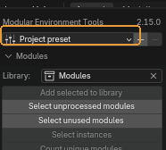{ .control-shot }

Список пресетов проекта и действия с ними.

**Когда пригодится.** Когда на проекте договорились о префиксах, единицах и папке выгрузки, и это должно быть одинаковым у всех.

**Что получится.** Пресеты — обычные JSON-файлы в папке, которая задаётся в настройках аддона. Направьте её на сетевую шару или в папку проекта, и весь проект увидит одни и те же пресеты. Кнопка меню показывает, из какого пресета настроена эта сцена.

!!! warning "Обратите внимание"
    Внизу меню — **Import from file** и **Send to file**. Общая папка удобнее, но файл работает всегда: импорт кладёт присланный пресет в папку и сразу применяет, поэтому в следующий раз он уже будет в списке. Пресет, записанный другой версией аддона, применяется в той части, которая понятна, а не отвергается целиком.

### Сохранить пресет

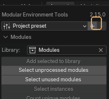{ .control-shot }

Записывает текущие настройки проекта в папку пресетов.

**Когда пригодится.** Настроили сцену под проект — сохраните, чтобы остальные загрузили то же самое.

### Удалить пресет

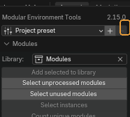{ .control-shot }

Убирает загруженный пресет из папки.

!!! warning "Обратите внимание"
    Удаляется файл в общей папке, а не только у вас: если папка сетевая, пресет исчезнет у всего проекта.

## Library — библиотека модулей

Коллекция уникальных мешей. Всё остальное в сцене — инстансы, то есть объекты, построенные на тех же данных.

### Library

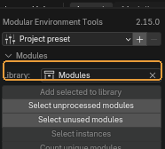{ .control-shot }

Коллекция, в которой лежат уникальные модули.

**Когда пригодится.** Укажите ту, что уже заведена на проекте. Пустое поле означает «искать `Modules`».

**По умолчанию:** коллекция с именем `Modules`, если она есть

!!! warning "Обратите внимание"
    От этого поля зависят почти все инструменты раздела: они считают модулем то, что лежит здесь.

### Add selected to library

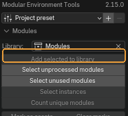{ .control-shot }

Линкует выделенные меши в библиотеку модулей.

**Когда пригодится.** Когда новый модуль готов и должен стать частью набора.

!!! warning "Обратите внимание"
    Это **единственная** кнопка, которой разрешено создавать коллекцию библиотеки. Остальные инструменты, не найдя её, честно об этом сообщают, а не заводят молча.

### Select unprocessed modules

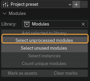{ .control-shot }

Выделяет видимые меши, чьи данные не входят в библиотеку.

**Когда пригодится.** Проверка «что ещё не занесено». После неё видно, какие объекты сцены живут сами по себе.

### Select unused modules

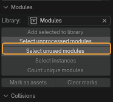{ .control-shot }

Выделяет модули библиотеки, которыми в сцене никто не пользуется.

**Когда пригодится.** Перед сдачей набора: такой модуль либо забыли поставить, либо он лишний.

### Select instances

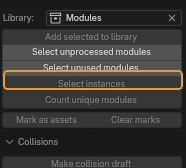{ .control-shot }

Выделяет все объекты сцены, построенные на тех же мешах, что и выделенные.

**Когда пригодится.** Чтобы понять, сколько раз модуль стоит в сцене, и найти все его копии разом — например, перед правкой.

### Count unique modules

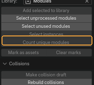{ .control-shot }

Считает, сколько уникальных мешей делят выделенные объекты.

**Когда пригодится.** Быстрый ответ на вопрос «из скольких разных модулей собран этот кусок уровня». Ничего не меняет.

### Mark as assets / Clear marks

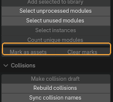{ .control-shot }

Помечает выделенные модули как ассеты и рисует им превью — после этого их можно перетаскивать из Asset Browser. Вторая кнопка метку снимает.

**Когда пригодится.** Когда набор дошёл до состояния, в котором им пользуются другие: из браузера ассетов модуль ставится перетаскиванием, без открытия исходного файла.

## Collisions — коллизии

Черновые коллизии в конвенции движка: выпуклые оболочки с префиксом `UCX` и коробки с `UBX`.

### Make collision draft

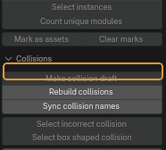{ .control-shot }

Делает из каждого выделенного меша черновую коллизию, названную и пронумерованную так, как ждёт движок.

**Когда пригодится.** Первый шаг по коллизиям: получить оболочку, которую дальше правят руками.

**Что получится.** Копия параентится к оригиналу, получает материал коллизии и стек модификаторов — выпуклые оболочки по островам, упрощение и поджатие внутрь. Стек остаётся живым, если не включено **Apply modifiers**.

### Rebuild collisions

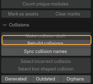{ .control-shot }

Пересобирает выделенные коллизии из их источников.

**Когда пригодится.** После правки модуля. Без выделения пересобирает **все устаревшие коллизии сцены** — это и есть обычный способ.

### Sync collision names

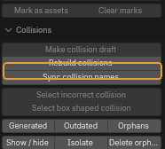{ .control-shot }

Переименовывает коллизии по модулю, к которому они привязаны, с нумерацией по порядку.

**Когда пригодится.** Сразу после переименования модулей. Движок связывает коллизию с мешем по имени, поэтому рассинхрон здесь стоит дорого.

### Select incorrect collision

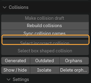{ .control-shot }

Ищет среди выделенного острова коллизий, которые не замкнуты или вырождены в плоскость.

**Когда пригодится.** Перед выгрузкой. Такая оболочка в движке ведёт себя непредсказуемо.

**Что получится.** Оставляет сцену в режиме редактирования с подсвеченными проблемными вершинами.

### Select box shaped collision

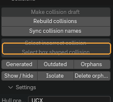{ .control-shot }

Выделяет коллизии, которые на деле — обычные коробки по осям.

**Когда пригодится.** Чтобы переименовать их из префикса выпуклой оболочки в префикс коробки: движку коробка обходится дешевле.

### Generated / Outdated / Orphans

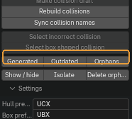{ .control-shot }

Три набора выделения: всё, что аддон сгенерировал; коллизии, чей исходный меш правили после генерации; коллизии, чей исходник из файла исчез.

**Когда пригодится.** **Outdated** — главный: он отвечает на вопрос «что пересобрать». **Orphans** показывает мусор, оставшийся от удалённых модулей.

### Show / hide, Isolate, Delete orphans

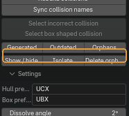{ .control-shot }

Скрыть или показать все коллизии сцены; спрятать всё, кроме них; удалить осиротевшие.

**Когда пригодится.** **Isolate** — когда оболочки надо разглядеть отдельно от геометрии; повторное нажатие возвращает сцену.

!!! warning "Обратите внимание"
    **Delete orphans** удаляет объекты безвозвратно. Сначала посмотрите на них кнопкой **Orphans**.

### Collision prefix и Box prefix

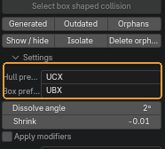{ .control-shot }

Префиксы имён для выпуклой оболочки и для коробки.

**Когда пригодится.** Значения по умолчанию — конвенция Unreal. Меняйте, если движок на проекте ждёт другое.

**По умолчанию:** `UCX` и `UBX`

### Форма оболочки

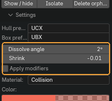{ .control-shot }

Предел упрощения плоских участков, поджатие оболочки внутрь меша и выбор «запечь стек или оставить живым».

**Когда пригодится.** **Displace strength** отрицательный: оболочка утапливается внутрь, чтобы не торчала сквозь геометрию.

!!! warning "Обратите внимание"
    Пока **Apply modifiers** выключен, стек остаётся живым, и коллизию можно пересобрать. Включите его, только когда форма окончательная.

### Материал коллизий

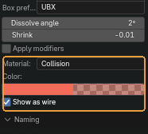{ .control-shot }

Имя материала, его цвет во вьюпорте и показ оболочек сеткой.

**Когда пригодится.** Цвет меняется на лету и перекрашивает уже созданные коллизии. Сетка — то, как их рисует движок; выключите, чтобы смотреть залитыми.

## Naming — размеры и префиксы в именах

### Оси и порядок

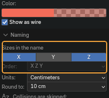{ .control-shot }

Какие габариты попадут в имя и в каком порядке.

**По умолчанию:** X и Z включены, порядок `XZY`

!!! warning "Обратите внимание"
    Порядок имеет смысл только при двух и более включённых осях. По умолчанию он `XZY`, а не `XYZ`: в модульных наборах ширина и высота важнее глубины.

### Единицы и округление

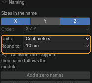{ .control-shot }

В чём писать размер и до какого шага округлять.

**Когда пригодится.** Шаг округления — именно шаг, а не число знаков: при 10 размеры лягут на десятки сантиметров, что и нужно модульной сетке.

**По умолчанию:** сантиметры, шаг 10

### Add size to names

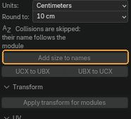{ .control-shot }

Дописывает габариты выделенных мешей в их имена.

**Когда пригодится.** Когда набор собран и по имени должно быть видно, какой модуль какого размера.

!!! warning "Обратите внимание"
    Повторный запуск **заменяет** размеры, а не дописывает ещё раз, — можно править геометрию и прогонять снова.

### UCX to UBX и UBX to UCX

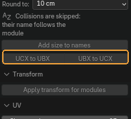{ .control-shot }

Меняет префикс коллизии у выделенных объектов в одну и в другую сторону.

**Когда пригодится.** В паре с **Select box shaped collision**: сначала найти коробки, потом перевести их в префикс коробок.

## Transform

### Apply transform for modules

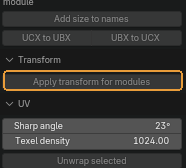{ .control-shot }

Применяет поворот и масштаб к выделенным объектам и ко всем инстансам, которые делят с ними меш.

**Когда пригодится.** Перед выгрузкой: движок ждёт единичный масштаб.

!!! warning "Обратите внимание"
    Применить трансформ к одному инстансу нельзя — данные общие, поэтому инструмент и обходит всю группу разом. Положение не трогается.

## UV

### Sharp angle и Texel density

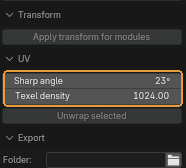{ .control-shot }

Угол, острее которого ребро считается швом, и плотность текселей.

**По умолчанию:** 22,5° и 1024

### Unwrap selected

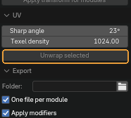{ .control-shot }

Помечает швы по острым рёбрам и разворачивает выделенные меши.

**Когда пригодится.** Черновая развёртка модуля, когда важнее скорость, чем ручная раскладка.

!!! warning "Обратите внимание"
    Ориентация островов по миру и texel density делаются через **ZenUV**. Без него швы и развёртка всё равно работают — панель прямо пишет об этом под настройками.

## Export

Выгрузка модулей в FBX вместе с их коллизиями.

### Куда писать

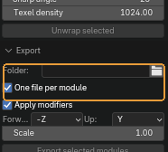{ .control-shot }

Папка выгрузки и способ раскладки: файл на модуль или всё выделенное в один файл.

**Когда пригодится.** Движку обычно нужен файл на модуль — так имя файла совпадает с именем ассета.

**По умолчанию:** файл на модуль; пустая папка означает `export` рядом с .blend

### Настройки FBX

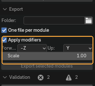{ .control-shot }

Оси, масштаб и вопрос, выгружать ли модификаторы применёнными.

**По умолчанию:** `-Z` вперёд, `Y` вверх, масштаб 1

!!! warning "Обратите внимание"
    **Apply modifiers** включён: живые стеки коллизий выгружаются посчитанными, иначе в движок уедет исходный меш вместо оболочки.

### Export selected modules

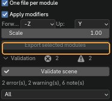{ .control-shot }

Пишет выделенные модули вместе с их коллизиями в FBX.

## Validation — проверка сцены

Прогон по модулям и коллизиям с отчётом, по которому можно ходить.

### Validate scene

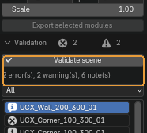{ .control-shot }

Прогоняет сцену по модулям и коллизиям и заполняет отчёт ниже.

**Когда пригодится.** Перед сдачей. Счётчики рядом показывают, сколько ошибок, предупреждений и замечаний найдено.

### Фильтр отчёта

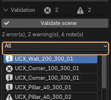{ .control-shot }

Какие находки показывать в списке.

**По умолчанию:** все

### Список находок

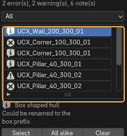{ .control-shot }

Строки отчёта: значок важности, объект и суть находки.

**Когда пригодится.** Клик по строке выделяет объект, о котором она.

### Select, All alike, Clear

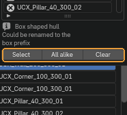{ .control-shot }

Выделить объект выбранной строки; выделить все объекты с такой же находкой; очистить отчёт.

**Когда пригодится.** **All alike** — способ чинить пачкой: одна и та же ошибка обычно повторяется по всему набору.

### Export report

Записывает отчёт в JSON.

**Когда пригодится.** Когда результат проверки нужен за пределами Blender — приложить к задаче или прогнать сборкой.

!!! warning "Обратите внимание"
    **Кнопки для него в панели нет.** Оператор есть, но наружу не выведен: вызывается через поиск — ++f3++ и «Export report».

---

*Страница собрана из файла `content/modular-environment-tools.ru.yml`. Снимки сделаны в **Modular Environment Tools 2.15.0**.*
