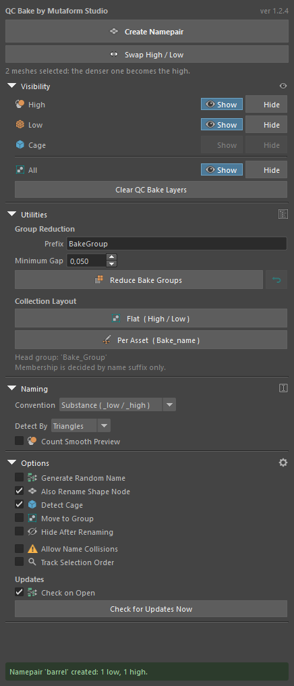

# QC Bake for Maya

Тот же QC Bake, что и для Blender, только в Maya. Приводит объекты к именам,
которые понимает запекатель: `asset_low`, `asset_high`, `asset_cage`. Дальше
умеет прятать половину пары, раскладывать аутлайнер и объединять далеко
разнесённые ассеты в общие группы запекания.

Всё, что он делает, — переименование и перекладывание по группам. Геометрию
аддон не трогает никогда.

{ .screenshot }

Как поставить аддон — на отдельной странице:
**[Установка](install.md)**.

## Быстрый старт

Есть высокополигональная скульптура и низкополигональная модель под неё.

1. Выделить обе. Порядок не важен.
2. Нажать **Create Namepair**.

Готово: объекты называются `<имя>_low` и `<имя>_high`. За основу взято имя того
объекта, который аддон посчитал низкополигональным, — из него вырезан старый
суффикс, если он там был.

Строка под кнопками читается ещё до нажатия: она говорит, сколько мешей
выделено и кого аддон считает хаем.

## Кто из них high

При **двух** выделенных объектах сравнивается плотность сеток, и хаем
объявляется тот, у кого треугольников больше. Признак сравнения меняется в
свитке **Naming → Detect By**: треугольники, полигоны или вершины.

При **трёх и более** низкополигональным будет один объект, остальные получат
нумерацию:

```text
asset_low
asset_high_01
asset_high_02
```

Какой именно станет лоу, зависит от галки **Track Selection Order**.

!!! tip "Отличие от Blender"
    В Blender есть активный объект — тот, что выделен последним и обведён
    светлым. У Maya такого понятия нет, и порядок выделения она по умолчанию
    не запоминает вовсе. Галка **Options → Track Selection Order** включает
    отслеживание порядка: тогда лоу — выделенный последним. Пока она снята,
    лоу выбирается по весу сетки.

Если роли определились неправильно, **Swap High / Low** меняет их местами.

## Сглаженная сетка

Отдельная галка, которой в версии для Blender нет: **Naming → Count Smooth
Preview**.

Maya показывает сглаженную модель по клавише ++3++, но `polyEvaluate` этого
сглаживания не видит и считает базовую сетку. Хай, который вы смотрите
сглаженным, для аддона оказывается лёгким — и легко проигрывает лоу по
треугольникам. Галка заставляет считать то, что видно на экране.

## Спрятать половину сцены

Свиток **Visibility** скрывает и показывает объекты по ролям — по всей сцене
сразу, независимо от выделения. Строка роли, которой в сцене нет, неактивна:
пока не нажат Create Namepair, все строки серые.

!!! note "Почему это сделано на display layers"
    Аддон не выставляет видимость объектам напрямую, а заводит слои. Поэтому он
    **не затирает то, что вы скрыли руками**: включение роли возвращает прежнее
    состояние, а не то, которое инструмент счёл правильным.

    Убрать служебные слои перед отдачей сцены — **Clear QC Bake Layers**. Имён
    и объектов это не касается.

## Раскладка аутлайнера

Свиток **Utilities → Collection Layout**. Обе кнопки работают со всей сценой и
берут объекты по суффиксу, поэтому пропы и вспомогательная геометрия не
затрагиваются. Геометрия при группировке не сдвигается.

**Flat** складывает всё по ролям:

```text
Bake_Group
├── High
├── Low
└── Cage
```

**Per Asset** — по парам:

```text
Bake_Group
├── Bake_barrel
├── Bake_crate
└── Bake_pillar
```

В режиме Per Asset группы помечаются цветом: зелёная — пара полная, можно печь;
красная — участника не хватает или внутри лежит посторонний объект.

## Много ассетов в одной сцене

Когда в сцене десяток мелких пар, печь каждую отдельным проходом расточительно.
Ассеты, разнесённые в пространстве достаточно далеко, не проецируются друг в
друга, а значит могут делить один проход запекания.

Этим занимается **Utilities → Reduce Bake Groups**. Аддон берёт все полные пары,
смотрит на габаритные коробки и объединяет те, что отстоят друг от друга дальше,
чем **Minimum Gap**.

```text
BakeGroup_01_low
BakeGroup_01_high_01
BakeGroup_01_high_02
BakeGroup_02_low
...
```

!!! warning "Откат переживает перезапуск"
    Стрелка рядом с кнопкой возвращает имена, какими они были до последнего
    прогона. Старые имена хранятся прямо в сцене, поэтому откат работает и
    завтра, когда стек отмены Maya давно пуст.

    Откатывается только **последний** прогон. Если запустить Reduce дважды,
    первый набор имён будет потерян.

## Обновления

В Maya нет репозитория аддонов, поэтому проверка обновлений встроена в саму
панель. При каждом её открытии инструмент спрашивает манифест на GitHub Pages,
нет ли версии новее. Проверка идёт в фоне и молчит, если не удалась.

Когда новая версия есть, сверху появляется полоса с кнопкой **Install**. По ней
архив скачивается, сверяется с контрольной суммой, распаковывается и подменяет
папку — **без перезапуска Maya**. Прежняя версия хранится, пока новая не
загрузится, поэтому сломанный релиз откатывает себя сам.

Выключить автопроверку или запустить её вручную — **Options → Updates**.

## Чем отличается от версии для Blender

Функционально это тот же инструмент. Иначе устроены три вещи, и это осознанные
решения:

| | Blender | Maya |
| --- | --- | --- |
| Настройки | в сцене | в `optionVars`, то есть следуют за художником, а не за файлом |
| Группировка | коллекции | группы, а показ и скрытие — display layers |
| Плотность сетки | считается как есть | есть галка **Count Smooth Preview**, потому что `polyEvaluate` не видит smooth preview |

## Что дальше

Разбор каждой кнопки и каждой галки — в
[справочнике интерфейса](reference.md).
