# What every button does

The panel opens from the **QC Bake** button on the *Mutaform* shelf. It is dockable: leave it floating, or dock it to Maya's side panel. The order of sections here follows the panel from top to bottom.

## The main buttons

Two buttons, and a line under them that says in advance what will happen.

### Create Namepair

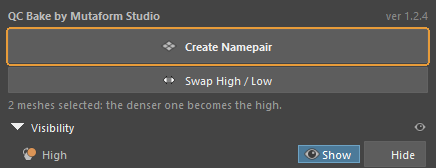{ .control-shot }

Renames the selected meshes into a pair: `<name>_low` and `<name>_high`.

**When you need it.** The main action. Select the meshes of an asset and press it — selection order does not matter, the roles are worked out for you.

**What happens.** With two meshes the denser one becomes the high. With three or more, one is the low and the rest are numbered: `asset_high_01`, `asset_high_02`. Which one ends up as the low depends on **Track Selection Order**: with it, the one selected last; without it, the lightest mesh. The name comes from the low, with any old suffix cut off. Namespaces are preserved: an object from `chair:parts` stays there.

**When it is greyed out.** Fewer than two meshes are selected. Only meshes count: curves, locators and cameras are ignored.

!!! warning "Worth knowing"
    Renaming is all the button does. It never touches geometry.

### Swap High / Low

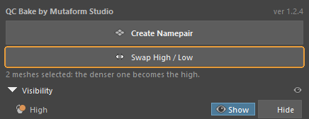{ .control-shot }

Swaps the roles of a pair.

**When you need it.** When the automatic choice was wrong. That happens with a dense low against a rough blockout: by triangle count the low weighs more, though by intent it is still the low.

**What happens.** Faster than renaming by hand: the names swap along with their suffixes.

**When it is greyed out.** The selection holds no complete pair: no object with the low suffix and one with the high suffix.

### The line under the buttons

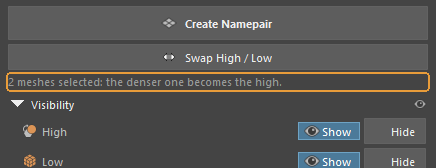{ .control-shot }

Says what pressing will do, before you press.

**When you need it.** Worth reading every time: it shows in advance which mesh is taken for the high. If that disagrees with your intent, **Swap High / Low** or the **Track Selection Order** option will fix it.

**What happens.** With nothing selected it reads "Nothing selected". With two meshes it says how many are selected and that the denser one becomes the high.

## Visibility — show and hide

Shows and hides objects by role, across the whole scene at once. Built on Maya's display layers.

### A role row (High, Low, Cage)

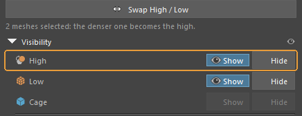{ .control-shot }

Shows and hides every object of that role across the whole scene, regardless of the selection.

**When you need it.** To look at the low without the high looming over it, and back again.

**What happens.** The pressed button lights up. A role with nothing in the scene stays unavailable: in an empty scene the cage row is greyed out.

**When it is greyed out.** The scene holds no objects with that suffix. Right after Create Namepair the High and Low rows come alive; Cage only if a cage really exists.

!!! warning "Worth knowing"
    It is built on display layers, and that matters more than it sounds: the add-on **does not overwrite visibility you set by hand**. Turning a role back on restores what was there, not what the tool assumed.

### The All row

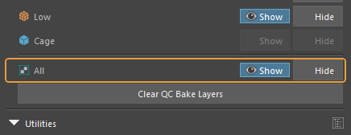{ .control-shot }

The same, for every role at once.

**When you need it.** To put the scene back quickly after half of it has been hidden.

### Clear QC Bake Layers

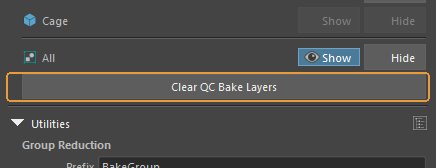{ .control-shot }

Removes the display layers the add-on created for switching visibility.

**When you need it.** Before handing the scene off, so no housekeeping layers travel with it. Objects and their names are untouched — only the layers go.

## Utilities — the scene as a whole

Merging widely separated pairs into shared bake groups, and organising the outliner.

### Prefix

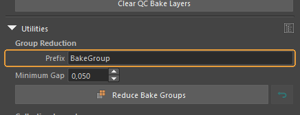{ .control-shot }

The start of the name that merged bake groups will get.

**When you need it.** Change it if the project has its own naming rules. Names like `BakeGroup_01_low` are built from it.

**Default:** BakeGroup

### Minimum Gap

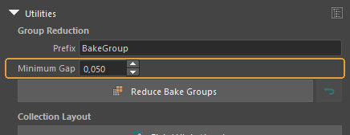{ .control-shot }

The smallest distance between bounding boxes at which two pairs may be merged into one group.

**When you need it.** The larger the value, the more cautious the merge and the more groups remain.

**Default:** 0.050

!!! warning "Worth knowing"
    The point is that rays from one asset must not land on another's high. Pairs standing close together cannot be merged — someone else's geometry would bake in.

### Reduce Bake Groups

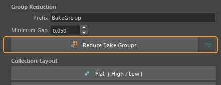{ .control-shot }

Merges pairs that sit far apart in space into fewer bake groups. The arrow on the right restores the previous names.

**When you need it.** When a scene holds a dozen small assets and baking each in its own pass is wasteful. Assets far enough apart do not project into one another, so they can share a pass.

**What happens.** Objects take a shared group name: `BakeGroup_01_low`, `BakeGroup_01_high_01` and so on. Incomplete pairs are skipped, and the add-on reports how many.

!!! warning "Worth knowing"
    Every rename is written into the scene, so **Restore still works tomorrow**, long after Maya's undo stack is empty. It restores the last run; run Reduce twice and the first set of names is gone.

### Flat ( High / Low )

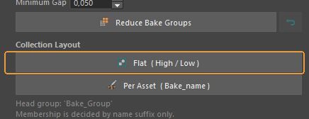{ .control-shot }

Organises the outliner by role: `High`, `Low` and `Cage` groups under a shared `Bake_Group`.

**When you need it.** When it is easier to see everything low-poly together.

!!! warning "Worth knowing"
    Membership is decided **by name suffix only**, so props and helper meshes are left alone. Grouping does not move any geometry.

### Per Asset ( Bake_name )

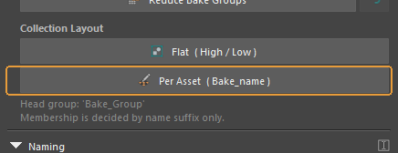{ .control-shot }

Organises the outliner by pair: each asset gets its own `Bake_<name>` group.

**When you need it.** When there are many assets and it matters which pair is incomplete.

**What happens.** The group is colour-tagged: green when the pair is complete and ready to bake, red when a member is missing or a stranger sits inside. Visible in the outliner at a glance, without expanding anything.

## Naming — which suffixes to use

### Convention

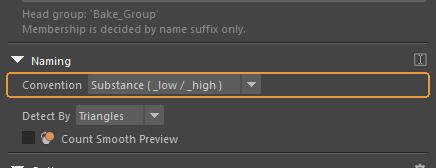{ .control-shot }

The set of suffixes that mark the roles.

**When you need it.** Pick whatever your baker expects. The choice affects more than renaming: the same suffixes are how the add-on finds objects for Visibility and for both utilities, so after switching presets the old objects stop existing as far as it is concerned.

**Default:** Substance ( _low / _high )

### Detect By

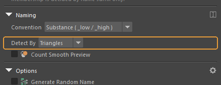{ .control-shot }

The measure used to compare mesh density.

**When you need it.** Change it when triangles give the wrong answer. Faces and vertices are the alternatives.

**Default:** Triangles

### Count Smooth Preview

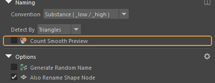{ .control-shot }

Whether to count the smoothed mesh instead of the base one.

**When you need it.** Turn it on when you work with smooth preview enabled — the "3" key.

**Default:** off

!!! warning "Worth knowing"
    The Blender version has no such option; Maya forced it. `polyEvaluate` does not see smooth mesh preview, so without the tick a high you are viewing smoothed is counted by its base cage — and easily comes out "lighter" than the low.

## Options — behaviour while renaming

### Generate Random Name

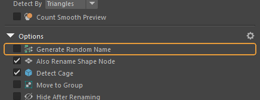{ .control-shot }

Gives the pair a random name instead of the source object's name.

**When you need it.** When the source names are rubbish like `pCube12` and there is no time to invent something better.

**Default:** off

### Also Rename Shape Node

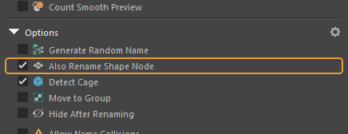{ .control-shot }

Renames the shape node along with its transform.

**When you need it.** Leave it on. Otherwise the scene keeps a `barrel_low` with a `pCubeShape1` inside, and that shows up in the exported FBX.

**Default:** on

### Detect Cage

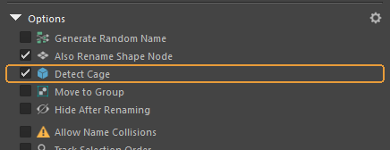{ .control-shot }

Excludes from the comparison any object whose name already ends with the cage suffix.

**When you need it.** The cage has to be named beforehand — `anything_cage` will do. The add-on does not try to guess a cage from geometry.

**Default:** on

### Move to Group

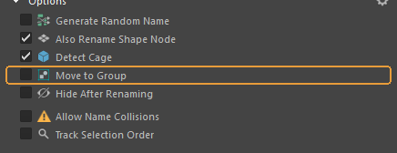{ .control-shot }

Puts the pair into a group right after renaming.

**Default:** off

### Hide After Renaming

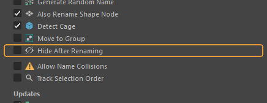{ .control-shot }

Hides the high as soon as the pair is made.

**When you need it.** Handy when the high is only there for baking and gets in the way of looking at the low.

**Default:** off

### Allow Name Collisions

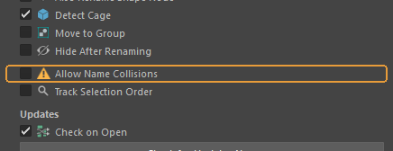{ .control-shot }

Allows renaming when the wanted name is already taken.

**Default:** off

!!! warning "Worth knowing"
    This is exactly how a `barrel_low1` appears in a scene. To a baker that is a different name, and the pair falls apart. Only worth enabling when you know why the name is taken.

### Track Selection Order

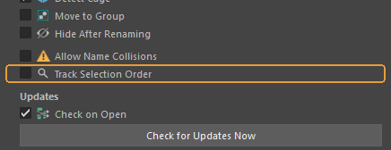{ .control-shot }

Respect the selection order: the mesh selected last is taken as the low.

**When you need it.** Turn it on when you want to set the roles yourself rather than leave them to a triangle count.

**Default:** off

!!! warning "Worth knowing"
    Another difference from Blender: there is an active object there, and Maya has none. The tick switches on Maya's own selection-order tracking, and until then the order simply is not recorded.

## Updates

Maya has no add-on repository, so the update check is built into the tool itself.

### Check on Open

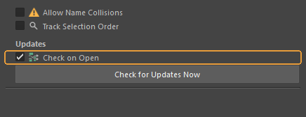{ .control-shot }

Check for a newer version every time the panel opens.

**What happens.** The check runs on a background thread and stays quiet if it fails. When a newer version is found, a bar with an **Install** button appears at the top of the panel. It installs nothing by itself.

**Default:** on

### Check for Updates Now

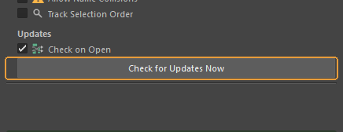{ .control-shot }

Check for updates immediately.

**When you need it.** When the automatic check is off, or you want to be sure right now. Unlike the background one, this check also reports failure.

!!! warning "Worth knowing"
    Pressing **Install** downloads the archive, verifies it against the checksum, unpacks it and swaps the folder — **without restarting Maya**. The previous version is kept until the new one has loaded, so a broken release rolls itself back.

### The status line

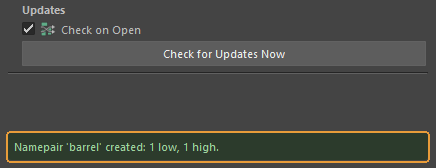{ .control-shot }

The outcome of the last action, at the bottom of the panel.

**When you need it.** The first place to look when it seems nothing happened: both "Namepair 'barrel' created: 1 low, 1 high" and the reason for a refusal land here.

---

*Assembled from `content/qc-bake-maya.en.yml`. Screenshots taken in **QC Bake for Maya 1.2.4**.*
