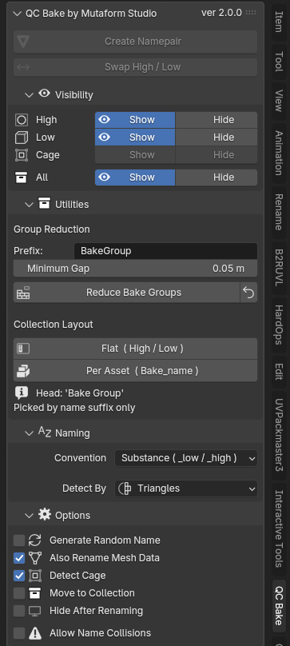
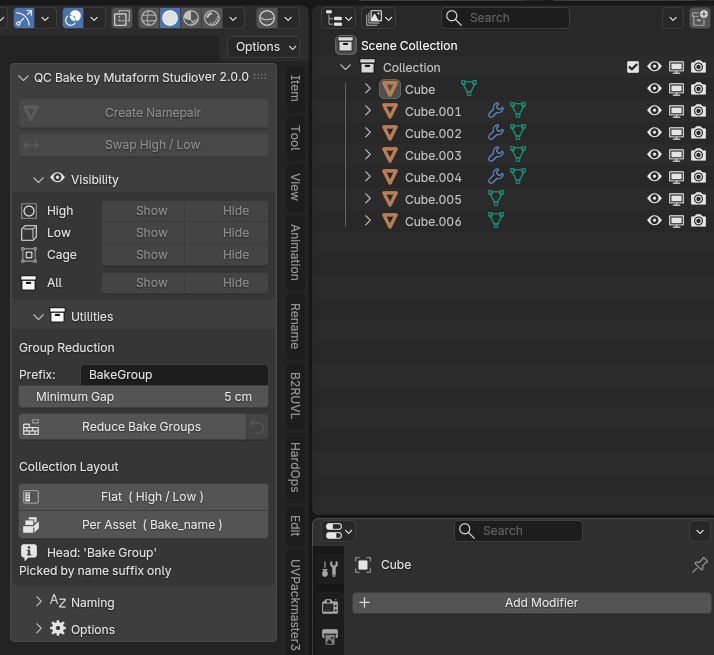
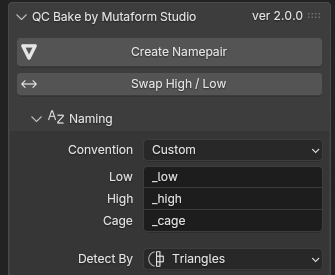
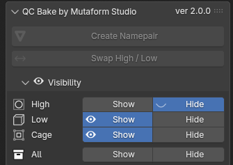
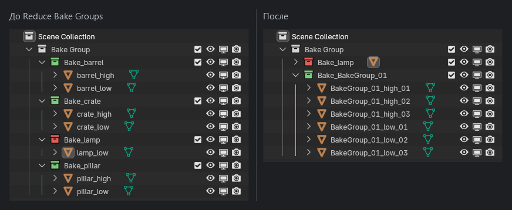

# QC Bake

Аддон приводит объекты к именам, которые понимает запекатель: `asset_low`,
`asset_high`, `asset_cage`. Дальше он же умеет прятать половину пары, раскладывать
сцену по коллекциям и объединять далеко разнесённые ассеты в общие группы
запекания.

Всё, что он делает, — это переименование и перекладывание по коллекциям.
Геометрию аддон не трогает никогда.

{ .screenshot }

Как поставить аддон — на отдельной странице:
**[Установка](install.md)**.

## Быстрый старт

Есть высокополигональная скульптура и низкополигональная модель под неё.

1. Выделить обе. Порядок не важен.
2. Нажать **Create Namepair**.

Готово: объекты называются `<имя>_low` и `<имя>_high`. За основу взято имя того
объекта, который аддон посчитал низкополигональным, — из него вырезан старый
суффикс, если он там был.

{ .screenshot }

Запись идёт дальше быстрого старта: после переименования на ней нажимают
**Flat**, а потом **Per Asset** — то, что разбирается ниже, в разделе про
раскладку по коллекциям. В кадре только панель и аутлайнер, чтобы имена
читались.

## Кто из них high

При **двух** выделенных объектах аддон сравнивает их по количеству
треугольников и объявляет высокополигональным тот, у которого их больше.
Считается итоговая геометрия — с учётом модификаторов, так что Subdivision
Surface на низкополигональной модели вполне может перевернуть результат.

Признак сравнения меняется в свитке **Naming → Detect By**: треугольники
(по умолчанию), полигоны или вершины.

При **трёх и более** выделенных объектах гадать аддон не станет. Тогда правило
такое: низкополигональный — это активный объект, то есть тот, что выделен
последним и обведён светлым контуром. Все остальные становятся высокополигональными
и получают нумерацию:

```text
asset_low
asset_high_01
asset_high_02
asset_high_03
```

!!! tip "Если роли определились неправильно"
    Выделить оба объекта и нажать **Swap High / Low** — они поменяются ролями.
    Это быстрее, чем переименовывать вручную.

## Клетка

Клетка (cage) распознаётся по имени: если среди выделенных объектов есть такой,
чьё имя **уже** заканчивается на `_cage`, аддон исключит его из сравнения
high/low и просто переименует в `<база>_cage`.

То есть клетку нужно назвать заранее — хотя бы `что-угодно_cage`. Автоматически
угадать клетку по геометрии аддон не пытается.

Отключается галочкой **Options → Detect Cage**.

## Соглашения об именах

Свиток **Naming → Convention**:

| Пресет | Суффиксы |
| --- | --- |
| Substance | `_low` `_high` `_cage` |
| Marmoset | то же самое |
| xNormal | `_lo` `_hi` `_cage` |
| Custom | свои, задаются в трёх полях ниже |

Substance и Marmoset дают одинаковый результат — это два названия одного
пресета, оставленные для наглядности.

{ .screenshot }

Выбор влияет не только на переименование. По этим же суффиксам аддон ищет
объекты для панели Visibility и для обеих утилит, так что после смены пресета
старые объекты для него перестают существовать.

## Спрятать половину сцены

Свиток **Visibility** скрывает и показывает объекты по роли — по всей сцене
сразу, независимо от выделения.

{ .screenshot }

Состояние кнопок читается так:

- кнопка вдавлена, на ней глаз — вся группа в этом состоянии;
- ни одна не вдавлена — часть объектов скрыта, часть нет;
- строка неактивна — объектов с таким суффиксом в сцене нет вовсе.

## Раскладка по коллекциям

Свиток **Utilities → Collection Layout**. Обе кнопки работают со всей сценой и
берут объекты по суффиксу, поэтому пропы и вспомогательная геометрия не
затрагиваются.

**Flat** складывает всё по ролям:

```text
Bake Group
├── High
├── Low
└── Cage
```

**Per Asset** — по парам:

```text
Bake Group
├── Bake_barrel
├── Bake_crate
└── Bake_pillar
```

Коллекции в режиме Per Asset помечаются цветом: зелёная — в паре есть и low, и
high, можно печь; красная — чего-то не хватает. Неполные пары видно в аутлайнере
сразу, без раскрытия.

{ .screenshot }

Переключаться между раскладками можно сколько угодно — каждая кнопка
перестраивает дерево с нуля и убирает опустевшие коллекции.

## Много ассетов в одной сцене

Когда в сцене десяток мелких пар, печь каждую отдельным проходом расточительно.
Ассеты, разнесённые в пространстве достаточно далеко, не проецируются друг в
друга, а значит могут делить один проход запекания.

Этим занимается **Utilities → Reduce Bake Groups**. Аддон берёт все полные пары,
смотрит на их габаритные коробки и объединяет в группу те, что отстоят друг от
друга дальше, чем **Minimum Gap**. Объекты объединённой группы получают общее
имя:

```text
BakeGroup_01_low
BakeGroup_01_high_01
BakeGroup_01_high_02
BakeGroup_02_low
...
```

{ .screenshot }

Что стоит знать:

- Пары без пары (только low или только high) пропускаются. Сколько их было,
  аддон пишет в статусной строке.
- Чем больше **Minimum Gap**, тем осторожнее объединение и тем больше групп
  останется. Значение по умолчанию — 0.05 — рассчитано на сцену в метрах.
- Если безопасного объединения не нашлось, ничего не переименовывается.

!!! warning "Откат"
    Кнопка со стрелкой рядом — **Restore Bake Groups** — возвращает имена, какими
    они были до последнего прогона Reduce. Старые имена хранятся прямо на
    объектах, поэтому откат переживает сохранение и перезагрузку файла и не
    зависит от истории отмен Blender.

    Откатывается только **последний** прогон. Если запустить Reduce дважды,
    первый набор имён будет потерян.

    После отката раскладку по коллекциям надо перестроить заново.

## Когда аддон ругается

| Сообщение | Что произошло |
| --- | --- |
| `Select at least two mesh objects` | В выделении меньше двух мешей. Кривые, пустышки и лампы не в счёт. |
| `Both meshes have the same tris count` | Два объекта неразличимы по выбранному признаку. Смените Detect By или переименуйте вручную. |
| `Need at least two non-cage meshes` | Один из двух выделенных объектов распознан как клетка. Осталось меньше двух кандидатов. |
| `Name '...' already taken` | Нужное имя занято посторонним объектом. Переименуйте его — или включите **Allow Name Collisions**, и Blender добавит `.001`. |
| `Low and high suffixes must differ` | В пресете Custom заданы одинаковые суффиксы. |
| `Need at least two complete bake namepairs` | Reduce не нашёл в сцене двух полных пар. |
| `No safe group reduction found` | Все ассеты стоят слишком близко. Уменьшите Minimum Gap — либо объединять и правда нечего. |
| `No named bake objects found` | В сцене нет объектов с текущими суффиксами. Проверьте, тот ли пресет выбран. |

!!! danger "Про Allow Name Collisions"
    Галочка снимает блокировку, но именно так в сцене заводятся `asset_low.001`.
    Для запекателя это уже другое имя, и пара разваливается. Включать стоит,
    только когда точно понятно, почему имя занято.

## Что дальше

Полный перечень кнопок и настроек с идентификаторами операторов — в
[справочнике интерфейса](reference.md).
