# What every button does

Every control in the QC Bake panel: what it looks like, what it does and when it earns its place. Sections follow the order of the panel itself.

## The main buttons

Always visible, no fold needed. Both act on the current selection.

### Create Namepair

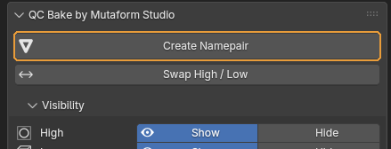{ .control-shot }

Renames the selected objects so a baker can tell which is the high poly and which is the low poly.

**When you need it.** As soon as a sculpt and the low poly built for it sit side by side. Select both — order does not matter — and press. With more than two objects, select the sculpts first and the low poly last: the active object (the one with the lighter outline) is the one the add-on treats as the low poly.

**What happens.** The objects become `barrel_low` and `barrel_high`. The base name comes from the low poly with any old suffix stripped. Several sculpts get numbered: `barrel_high_01`, `barrel_high_02`. The status bar reports what happened.

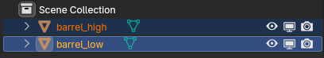{ .screenshot }

**When it is greyed out.** Fewer than two objects are selected. Only meshes count — curves, empties and lights do not.

!!! warning "Worth knowing"
    The comparison uses triangle counts from the evaluated mesh, modifiers included. A Subdivision Surface on the low poly can make it heavier than the sculpt and flip the roles. The next button fixes that.

### Swap High / Low

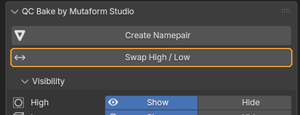{ .control-shot }

Swaps the roles of two objects: the one named `_low` becomes `_high` and the other way round.

**When you need it.** Right after Create Namepair, when you can see the guess went the wrong way. Faster than renaming by hand: the two names usually share a base, so by hand you would have to go through a temporary name.

**What happens.** Both objects trade names. Mesh data follows if Also Rename Mesh Data is on.

**When it is greyed out.** Not exactly two objects are selected, or they are not one low-suffixed and one high-suffixed object.

## Visibility — show and hide

Hides and shows objects by role across the whole scene, regardless of what is selected. There are four rows — High, Low, Cage and All — built the same way, so one stands for the others.

### A group row (High, Low, Cage)

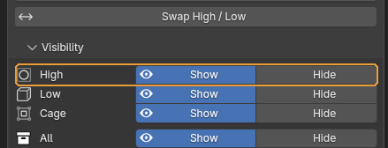{ .control-shot }

Shows or hides every object of that role across the scene. The Low and Cage rows work identically.

**When you need it.** When the sculpts are in the way of looking at the low poly, or the reverse. Handy with many pairs in the scene: nothing needs selecting, the add-on finds objects by suffix.

**What happens.** The objects hide or reappear in the viewport. Whichever button matches the group's current state is depressed and wears the eye icon.

!!! warning "Worth knowing"
    Read the state like this: depressed with an eye — the whole group is in that state; neither depressed — some hidden, some not; the whole row greyed out — no objects with that suffix exist at all.

### The All row

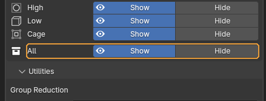{ .control-shot }

The same, but for every role at once — high, low and cage.

**When you need it.** To clear everything bake-related out of sight in one press and look at the rest of the scene — and to bring it all back just as quickly.

## Utilities — scene-wide work

Two unrelated things: merging bake groups, and sorting objects into collections. Both pick objects by the suffix in their name, so props and helper geometry are never touched.

### Prefix and Minimum Gap

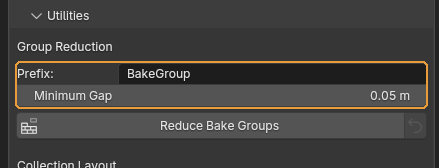{ .control-shot }

Two fields feeding the Reduce Bake Groups button next to them. **Prefix** is the base name for merged groups, with a number appended. **Minimum Gap** is how far apart assets must stand before they are allowed to share one bake pass.

**When you need it.** Raise Minimum Gap when traces of neighbouring assets show up on the baked maps. The larger it is, the more conservative the merge and the more groups survive.

**Default:** Prefix `BakeGroup`, Minimum Gap 5 centimetres (the value assumes a scene in metres).

!!! warning "Worth knowing"
    Spaces in Prefix become underscores. An empty field falls back to `BakeGroup`.

### Reduce Bake Groups

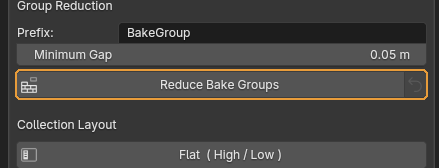{ .control-shot }

Merges several separate pairs into shared bake groups under a common name.

**When you need it.** When a scene holds a dozen small assets and baking each in its own pass is wasteful. Objects far apart in space cannot project into one another, so they can be baked together. The usual order: spread the assets out → make a pair for each → press Reduce → sort into collections.

**What happens.** Members of a merged group become `BakeGroup_01_low`, `BakeGroup_01_high_01` and so on. The status bar reports how many assets merged and how many incomplete pairs were skipped. If no safe merge exists, nothing is renamed — the assets sit too close.

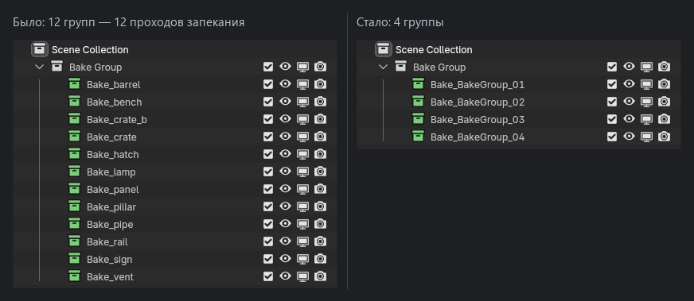{ .screenshot }

!!! warning "Worth knowing"
    The arrow button on the right undoes the last run. Old names are stored on the objects themselves, so the undo survives saving and reloading the file and does not depend on Blender's undo history. Only the **most recent** run can be undone. Run Reduce twice and the first set of names is gone for good. The arrow is greyed out when there is nothing to restore.

### Flat ( High / Low )

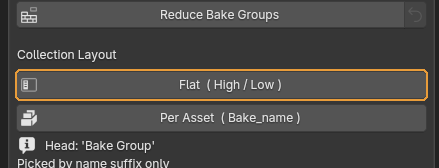{ .control-shot }

Sorts every bake object into collections grouped by role.

**When you need it.** When it is easier to work with all the sculpts at once: select them, hide them, hand them to another application.

**What happens.** A `Bake Group` collection appears holding `High`, `Low` and `Cage`. Collections left empty by previous layouts are removed and the Outliner tree is collapsed.

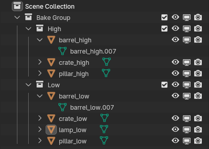{ .screenshot }

### Per Asset ( Bake_name )

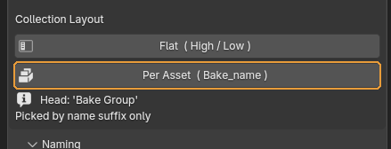{ .control-shot }

Sorts objects into collections grouped by pair — one collection per asset.

**When you need it.** When there are many assets and you need to see which pairs are incomplete. This is the mode to use before handing work off.

**What happens.** Each pair gets its own `Bake_<name>` collection, colour-tagged: **green** means both low and high are present and it is ready to bake, **red** means something is missing. Incomplete pairs are visible without expanding anything.

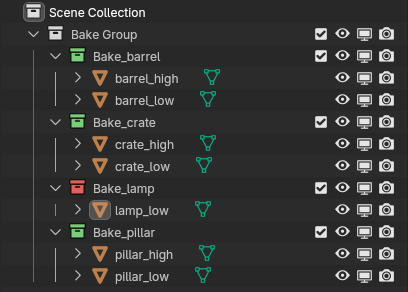{ .screenshot }

!!! warning "Worth knowing"
    Switch between Flat and Per Asset as often as you like — each button rebuilds the tree from scratch.

## Naming — which suffixes to use

Decides how roles are marked and which metric separates the high poly from the low poly.

### Convention

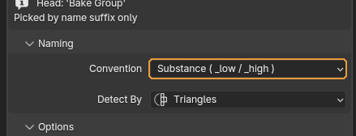{ .control-shot }

The set of suffixes that mark each role.

**When you need it.** Match it to the baker the asset is headed for. Substance and Marmoset produce the same result — two names for one set, kept for clarity. xNormal uses the short `_lo` and `_hi`.

**Default:** Substance — `_low`, `_high`, `_cage`.

!!! warning "Worth knowing"
    The choice affects more than renaming. The Visibility rows and both utilities find their objects by these same suffixes, so switching sets makes the older objects invisible to the add-on.

### Low / High / Cage

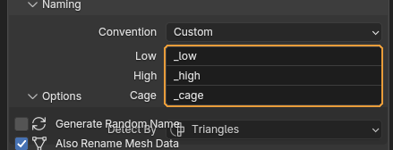{ .control-shot }

Three fields for your own suffixes. They appear only when Convention is set to Custom.

**When you need it.** When the project has its own naming and none of the presets fit.

!!! warning "Worth knowing"
    Low and High cannot be empty and cannot match each other — Create Namepair refuses and says so. Cage may be left empty, in which case cages play no part in what the add-on does.

### Detect By

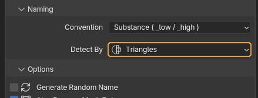{ .control-shot }

Which count decides which of two objects is the high poly.

**When you need it.** Triangles are the safest: the result does not depend on whether the object is built from quads or n-gons. Switch to Faces or Vertices only when the triangle counts came out equal.

**Default:** Triangles.

!!! warning "Worth knowing"
    The count comes from the evaluated mesh, modifiers included. If the counts match, the add-on refuses to guess and asks you to sort it out by hand.

## Options — how renaming behaves

Six checkboxes that shape what Create Namepair actually does.

### Generate Random Name

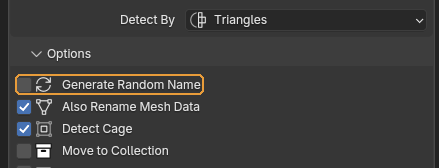{ .control-shot }

Gives the pair a random six-character name instead of the low poly's name.

**When you need it.** When the incoming names are junk — `Cube.023` and friends — and will be renamed properly later anyway.

**Default:** off

### Also Rename Mesh Data

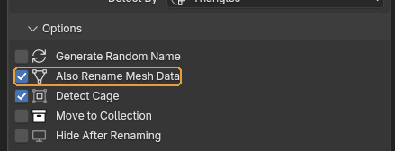{ .control-shot }

Renames the object's mesh data along with the object.

**When you need it.** Leave it on. Some pipelines key off the mesh data name rather than the object name when exporting FBX, and the mismatch is hard to trace later.

**Default:** on

### Detect Cage

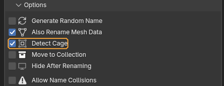{ .control-shot }

Treats whichever selected object already ends in the cage suffix as the cage and keeps it out of the high/low comparison.

**When you need it.** If you use cages. The cage has to be named beforehand — `anything_cage` will do. The add-on never guesses a cage from geometry.

**What happens.** That object is renamed `<base>_cage` and takes no part in deciding roles.

**Default:** on

### Move to Collection

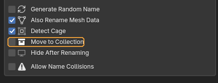{ .control-shot }

Puts the pair into its own `Bake_<name>` collection right after renaming.

**When you need it.** When pairs are made one at a time and you want the scene to sort itself. Making pairs in a batch, it is easier to sort everything at once with Per Asset.

**Default:** off

!!! warning "Worth knowing"
    The object is unlinked from every previous collection.

### Hide After Renaming

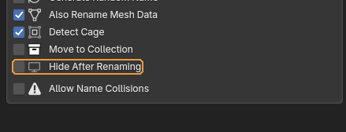{ .control-shot }

Hides the objects as soon as they are renamed.

**When you need it.** With many pairs in the scene, when each finished one gets in the way of the next.

**Default:** off

### Allow Name Collisions

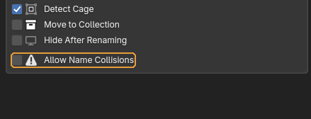{ .control-shot }

Lets renaming proceed even when the target name already belongs to another object.

**When you need it.** Almost never. Off is the safety net: the add-on stops and names the object that is in the way so you can deal with it.

**Default:** off

!!! warning "Worth knowing"
    With it on, Blender appends `.001`. To a baker `barrel_low.001` is simply a different name, and the pair falls apart. This is exactly how scenes end up with objects that "somehow will not bake".

---

*Assembled from `content/qc-bake.en.yml`. Screenshots taken in **QC Bake 2.0.0**.*
