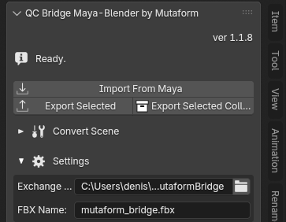

# QC Bridge Maya ↔ Blender

Moving scenes between Blender and Maya over FBX without setting paths and export
options by hand every time. Both sides watch the same exchange folder: one
writes, the other reads.

The bridge has two halves and you need both — the extension in Blender and the
scripts in Maya.

{ .screenshot }

## Installing in Blender

1. `Edit → Preferences → Get Extensions`
2. Gear icon → `Repositories` → `+` → `Add Remote Repository`
3. The URL:

    ```text
    https://mutaform.github.io/qc-bridge-blender-maya/index.json
    ```

4. Install `QC Bridge Maya-Blender by Mutaform`

Panel: ++n++ in the viewport → **QC Maya Bridge** tab. Requires Blender 4.2 or
newer.

## Installing in Maya

1. Close Maya.
2. Download [mutaform_bridge_maya_v1.zip](https://mutaform.github.io/qc-bridge-blender-maya/mutaform_bridge_maya_v1.zip)
   and unpack it.
3. Put the `mutaform_bridge` folder from the archive here:

    ```text
    C:\Users\YOUR_USERNAME\Documents\maya\2025\scripts\
    ```

    You should end up with `...\scripts\mutaform_bridge\`.

4. Start Maya, open `Windows → General Editors → Script Editor` and switch to
   the **Python** tab.
5. Paste and run this, with your own username:

    ```python
    import sys

    path = r"C:\Users\YOUR_USERNAME\Documents\maya\2025\scripts\mutaform_bridge"
    if path not in sys.path:
        sys.path.append(path)

    import install_shelf_button
    install_shelf_button.install()
    ```

A bridge button appears on the shelf. This is a one-time setup.

## The exchange folder

The **Settings** fold in the Blender panel:

- **Exchange Folder** — the shared folder, `Documents\MutaformBridge` by default;
- **FBX Name** — the file name, `mutaform_bridge.fbx` by default.

The one requirement: **Blender and Maya must point at the same folder**. If a
transfer does nothing, check that first.

The `.fbx` extension is appended automatically if you leave it out.

## Transferring

Blender to Maya:

- **Export Selected** — the selected objects;
- **Export Selected Coll…** — the selected collection, structure included.

Maya to Blender — **Import From Maya**, once Maya has written the file from its
shelf button.

The ⓘ row at the top of the panel reports the last operation; it reads `Ready.`
to start with. Error messages land there too, and that is the first place to
look when it seems nothing happened.

## Groups and collections

Maya builds hierarchy out of transform nodes, Blender out of collections. Over
FBX, Maya groups arrive as empties, which are awkward to work with.

Both conversions live under the **Convert Scene** fold, collapsed by default.

- **Convert Maya Empties to Collections** — turns an incoming hierarchy of
  empties into proper Blender collections.
- **Convert Collections to Maya Empties** — the reverse, before sending.

Both let you choose a scope — whole scene, selection, or the active object. The
**Bake Transforms** option applies accumulated transforms so objects land at the
same world coordinates.

!!! note "Units"
    Maya works in centimetres, Blender in metres. The bridge converts scale and
    axes on transfer, so models arrive at the right size and orientation.

## Next

The [interface reference](reference.en.md).
