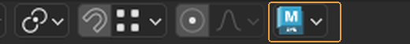
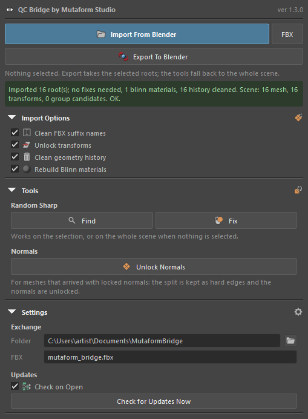

# QC Bridge Maya ↔ Blender

Moving scenes between Blender and Maya over FBX without setting paths and export
options by hand every time. Both sides watch the same exchange folder: one
writes, the other reads.

The bridge has two halves and you need both — the extension in Blender and the
tool in Maya.

How to install it is on its own page:
**[Installation](install.en.md)**.

## Where to find the bridge in Blender

A blue Maya icon in the **3D viewport header**, right after the Proportional
Editing buttons. Clicking it opens a menu with everything the bridge does.

{ .screenshot }

{ .screenshot }

!!! note "It used to be a sidebar tab"
    Before 1.2.0 the bridge lived in a **QC Maya Bridge** tab in the sidebar.
    That tab is gone: a header button is always in sight and takes up no screen
    space. The contents are the same.

## Where to find the bridge in Maya

The **QC Bridge** button on the *Mutaform* shelf. It opens a panel you can
leave floating or dock at the side, like any Maya panel.

{ .screenshot }

Two transfer buttons at the top, the selection line and the status strip below
them, then three folds: **Import Options** — what to clean in the incoming
scene, **Tools** — Random Sharp and Unlock Normals, **Settings** — the
exchange folder and updates.

!!! note "It used to be a separate window"
    Before 1.3.0 the Maya half was a window with an **Advanced** fold. The
    functions are the same, but the panel now docks and looks like the rest of
    the studio's Maya tools.

## The exchange folder

The **Settings** fold in the Blender panel:

- **Exchange Folder** — the shared folder, `Documents\MutaformBridge` by default;
- **FBX Name** — the file name, `mutaform_bridge.fbx` by default.

In Maya the same thing lives under **Settings → Exchange**.

The one requirement: **Blender and Maya must point at the same folder**. If a
transfer does nothing, check that first.

The `.fbx` extension is appended automatically if you leave it out.

## Transferring

Blender to Maya:

- **Export Selected** — the selected objects;
- **Export Selected Coll…** — the selected collection, structure included.

Maya to Blender — **Import From Maya**, once **Export To Blender** has been
pressed in Maya.

The ⓘ row at the top of the panel reports the last operation; it reads `Ready.`
to start with. Error messages land there too, and that is the first place to
look when it seems nothing happened.

## Groups and collections

Maya builds hierarchy out of transform nodes, Blender out of collections. Over
FBX, Maya groups arrive as empties, which are awkward to work with.

Both conversions live under the **Convert Scene** fold, collapsed by default.

- **Convert Maya Empties to Collections** — turns an incoming hierarchy of
  empties into proper Blender collections.
- **Convert Collections to Maya Empties** — the reverse, before sending.

Both let you choose a scope — whole scene, selection, or the active object. The
**Bake Transforms** option applies accumulated transforms so objects land at the
same world coordinates.

!!! note "Units"
    Maya works in centimetres, Blender in metres. The bridge converts scale and
    axes on transfer, so models arrive at the right size and orientation.

## Next

The [interface reference](reference.en.md).
