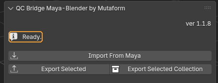
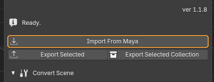
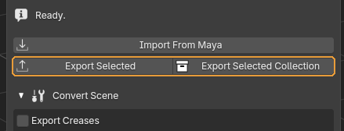
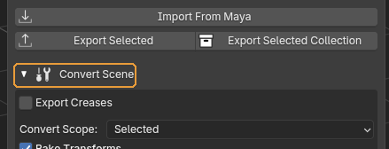
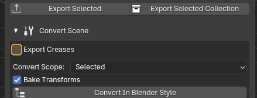
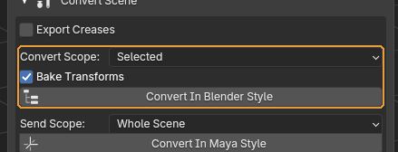
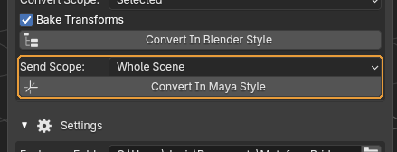
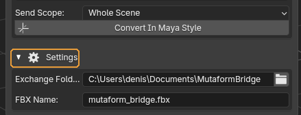
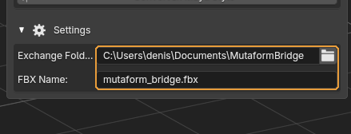

# What every button does

A walk through the bridge panel. Every transfer goes through a single file in a shared folder: one side writes, the other reads. When something does not work, the report line at the top of the panel is the first place to look.

## Transferring

The three buttons the bridge exists for. They use the exchange folder set at the bottom of the panel.

### The report line

{ .control-shot }

Reports how the last operation ended.

**When you need it.** Look here first when it seems nothing happened. Error messages land here too: file not found, nothing to export, no access to the folder.

**Default:** `Ready.` — nothing has been done yet.

### Import From Maya

{ .control-shot }

Loads the file written out from Maya into the current scene.

**When you need it.** After the bridge's shelf button has been pressed in Maya. The order is always the same: Maya writes, Blender reads.

**What happens.** Objects are added to whatever is already in the scene. Scale and axes are converted: Maya works in centimetres, Blender in metres.

!!! warning "Worth knowing"
    If a whole scene arrives from Maya and stacking it on top of the current one is not what you want, clear the scene beforehand — the import never deletes anything itself.

### Export Selected and Export Selected Collection

{ .control-shot }

Two export buttons. The left one sends the selected objects, the right one sends the selected collection whole, structure included.

**When you need it.** The right one matters when hierarchy does: the collection arrives in Maya as a group. The left one is for quickly throwing a couple of objects over.

**What happens.** An FBX appears in the exchange folder. Maya picks it up with the shelf button.

!!! warning "Worth knowing"
    It is always the same file with the name from the settings. Every export overwrites the previous one — if a colleague has not collected theirs yet, it is gone.

## Convert Scene — hierarchy

Collapsed by default. Needed because Maya builds hierarchy out of transform nodes and Blender out of collections, and FBX does not translate one into the other by itself.

### Convert Scene

{ .control-shot }

Opens the hierarchy conversion block.

**When you need it.** Worth opening right after importing from Maya: the groups that arrive look like empties, and they are awkward to work with in Blender.

**Default:** collapsed

### Export Creases

{ .control-shot }

Whether edge and vertex creases are sent to Maya.

**When you need it.** Turn it on only when creases are genuinely wanted on the other side — for instance when the model goes under a subdiv in Maya. It is off by default because creases usually just get in the way, arriving in Maya as extra attributes.

**Default:** off

### Convert In Blender Style

{ .control-shot }

Turns a hierarchy of empties from Maya into proper Blender collections.

**When you need it.** Straight after Import From Maya. **Convert Scope** decides what is processed: the whole scene, or only the selected empties.

**What happens.** The empties disappear, replaced by collections with the same structure.

!!! warning "Worth knowing"
    **Bake Transforms** is on by default and should stay that way: it applies the transforms accumulated on the empties so the meshes stay where they are. Without it objects scatter, because a group's transform vanishes along with the group.

### Convert In Maya Style

{ .control-shot }

The reverse: Blender collections become empties that Maya reads as groups.

**When you need it.** Before exporting, when the other side needs hierarchy. **Send Scope** picks the whole scene or the active collection.

## Settings — the exchange folder

Also collapsed. Set once and then left alone.

### Settings

{ .control-shot }

Opens the exchange folder settings.

**Default:** collapsed

### Exchange Folder and FBX Name

{ .control-shot }

The folder transfers go through, and the name of the file in it.

**When you need it.** Set once. The single requirement: Blender and Maya must point at **the same folder**. If a transfer does nothing, check that before anything else.

**Default:** `Documents\MutaformBridge` and `mutaform_bridge.fbx`.

!!! warning "Worth knowing"
    The `.fbx` extension is appended automatically if you leave it out. An empty name falls back to the default.

---

*Assembled from `content/qc-bridge.en.yml`. Screenshots taken in **QC Bridge Maya-Blender by Mutaform 1.1.8**.*
