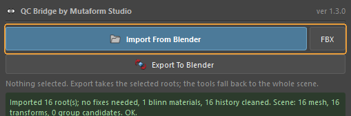
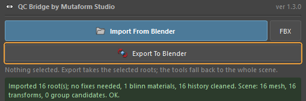
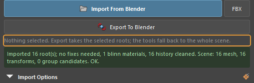
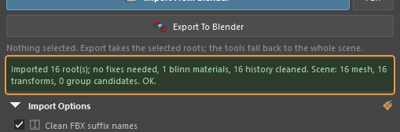
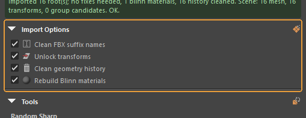
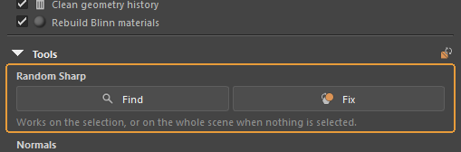
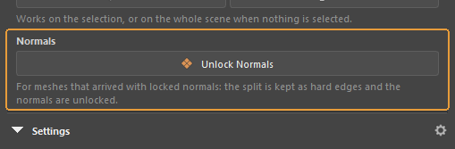
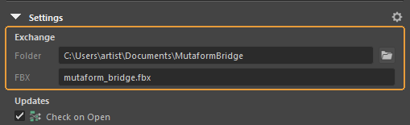
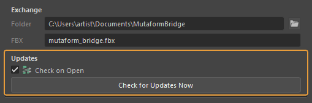

# What every button does

A breakdown of both halves of the bridge: the Blender menu first, then the Maya panel. In Blender the bridge has lived **in the 3D viewport header** since 1.2.0: a blue Maya icon right after the Proportional Editing buttons, with a dropdown behind it. There is no sidebar tab any more. In Maya, since 1.3.0, it is a **dockable panel** opened by the **QC Bridge** button on the *Mutaform* shelf. Every transfer goes through one file in a shared folder: one side writes it, the other reads it. When something does not work, the report line is the first place to look: at the top of the menu in Blender, in the status strip under the buttons in Maya.

## Blender — transferring

The three buttons the bridge exists for. They use the exchange folder set at the bottom of the panel.

### The report line

{ .control-shot }

Reports how the last operation ended.

**When you need it.** Look here first when it seems nothing happened. Error messages land here too: file not found, nothing to export, no access to the folder.

**Default:** `Ready.` — nothing has been done yet.

### Import From Maya

{ .control-shot }

Loads the file written out from Maya into the current scene.

**When you need it.** After the bridge's shelf button has been pressed in Maya. The order is always the same: Maya writes, Blender reads.

**What happens.** Objects are added to whatever is already in the scene. Scale and axes are converted: Maya works in centimetres, Blender in metres.

!!! warning "Worth knowing"
    If a whole scene arrives from Maya and stacking it on top of the current one is not what you want, clear the scene beforehand — the import never deletes anything itself.

### Export Selected and Export Selected Collection

{ .control-shot }

Two export buttons. The left one sends the selected objects, the right one sends the selected collection whole, structure included.

**When you need it.** The right one matters when hierarchy does: the collection arrives in Maya as a group. The left one is for quickly throwing a couple of objects over.

**What happens.** An FBX appears in the exchange folder. Maya picks it up with the shelf button.

!!! warning "Worth knowing"
    It is always the same file with the name from the settings. Every export overwrites the previous one — if a colleague has not collected theirs yet, it is gone.

## Blender — Convert Scene, hierarchy

Collapsed by default. Needed because Maya builds hierarchy out of transform nodes and Blender out of collections, and FBX does not translate one into the other by itself.

### Convert Scene

{ .control-shot }

Opens the hierarchy conversion block.

**When you need it.** Worth opening right after importing from Maya: the groups that arrive look like empties, and they are awkward to work with in Blender.

**Default:** collapsed

### Export Creases

{ .control-shot }

Whether edge and vertex creases are sent to Maya.

**When you need it.** Turn it on only when creases are genuinely wanted on the other side — for instance when the model goes under a subdiv in Maya. It is off by default because creases usually just get in the way, arriving in Maya as extra attributes.

**Default:** off

### Convert In Blender Style

{ .control-shot }

Turns a hierarchy of empties from Maya into proper Blender collections.

**When you need it.** Straight after Import From Maya. **Convert Scope** decides what is processed: the whole scene, or only the selected empties.

**What happens.** The empties disappear, replaced by collections with the same structure.

!!! warning "Worth knowing"
    **Bake Transforms** is on by default and should stay that way: it applies the transforms accumulated on the empties so the meshes stay where they are. Without it objects scatter, because a group's transform vanishes along with the group.

### Convert In Maya Style

{ .control-shot }

The reverse: Blender collections become empties that Maya reads as groups.

**When you need it.** Before exporting, when the other side needs hierarchy. **Send Scope** picks the whole scene or the active collection.

## Blender — Settings, the exchange folder

Also collapsed. Set once and then left alone.

### Settings

{ .control-shot }

Opens the exchange folder settings.

**Default:** collapsed

### Exchange Folder and FBX Name

{ .control-shot }

The folder transfers go through, and the name of the file in it.

**When you need it.** Set once. The single requirement: Blender and Maya must point at **the same folder**. If a transfer does nothing, check that before anything else.

**Default:** `Documents\MutaformBridge` and `mutaform_bridge.fbx`.

!!! warning "Worth knowing"
    The `.fbx` extension is appended automatically if you leave it out. An empty name falls back to the default.

## Maya — the bridge panel

The other half. Since 1.3.0 it is a dockable panel in the same style as QC Bake for Maya and the validator: a title with the version number, one blue primary button, a status strip and three folds. The folds remember whether they were left open or closed.

### Import From Blender and FBX

{ .control-shot }

Takes the exchange file the Blender side wrote and tidies the scene up at once. The narrow **FBX** button beside it does the same for any other file, picked in a dialog.

**When you need it.** The main action in Maya. The cleanup is the point of the button: empties become groups, and names, transforms, history and materials are sorted out.

!!! warning "Worth knowing"
    What exactly gets cleaned is set by the ticks in the **Import Options** fold below.

### Export To Blender

{ .control-shot }

Writes the selected roots into the exchange file for Blender to pick up.

**When you need it.** The other direction. Select the roots of the hierarchies — everything below them travels along.

### The selection line

{ .control-shot }

A grey line saying what the panel will work on right now: what is selected, or that nothing is.

**When you need it.** Read it before pressing. A button that did nothing is an answer with the reason left out, so the panel says it aloud: `Nothing selected.` plus the reminder that export takes the selected roots and the tools fall back to the whole scene.

### The status strip

{ .control-shot }

The outcome of the last action, coloured by severity.

**When you need it.** The first place to look when it seems nothing happened. The import report lands here too — how many roots arrived, what was fixed, how many materials were rebuilt — along with error messages.

**Default:** empty until something is done

### Import Options

{ .control-shot }

A fold with four ticks: what to do with the arriving scene right after import. **Clean FBX suffix names** — strips the `FBXASC046###` tails FBX turns Blender's `.001` names into, on nodes, shapes and materials. **Unlock transforms** — unlocks translate, rotate, scale and visibility. **Clean geometry history** — deletes construction history on the incoming meshes. **Rebuild Blinn materials** — replaces the imported shaders with clean Blinns that keep the diffuse, normal and opacity textures.

**Default:** all four on

!!! warning "Worth knowing"
    The ticks are remembered between Maya sessions.

### Random Sharp — Find and Fix

{ .control-shot }

**Find** selects hard edges that are not UV borders. **Fix** softens them.

**When you need it.** These are exactly the edges the **Random Sharp** check in the validator reports. Here they can be seen and fixed without going back to Blender.

!!! warning "Worth knowing"
    Works on the selection, or on the whole scene when nothing is selected.

### Unlock Normals

{ .control-shot }

Converts locked normals that arrived with the import into ordinary Maya soft and hard edges.

**What happens.** The split is kept — it becomes hard edges — and the normals themselves are unlocked, so the mesh behaves like one built in Maya.

### Exchange — Folder and FBX

{ .control-shot }

The exchange folder and the file name in it, with a browse button beside the folder field.

**When you need it.** Set once. The one requirement: **Maya and Blender must point at the same folder**. If a transfer does nothing, check that before anything else.

!!! warning "Worth knowing"
    Since 1.2.0 the folder and the name are remembered between sessions.

### Updates

{ .control-shot }

A **Check on Open** tick and a **Check for Updates Now** button.

**What happens.** When a newer version exists, a strip with **Install** and **Skip** appears at the top of the panel. **Install** downloads the archive, verifies the checksum and swaps the folder — without restarting Maya; the old version is kept until the new one has loaded.

**Default:** the check on open is on

---

*Assembled from `content/qc-bridge.en.yml`. Screenshots taken in **QC Bridge Maya-Blender by Mutaform 1.3.0**.*
