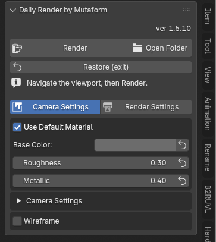

# QC Daily Render

A one-button studio render of your model — for dailies, previews and portfolio
shots. The add-on builds a Marmoset-style studio around whatever is in the
scene: HDRI lighting, a single material, a contact shadow, post-processing. It
captures exactly the angle you see in the viewport and saves a PNG with a
transparent background.

Nothing in the scene is broken along the way: **Restore** puts everything back,
render settings included.

{ .screenshot }

## Installation

This add-on has no repository yet — install it from a file.

1. Get the latest `mutaform_studio_render_vX.Y.Z_extension.zip`
2. `Edit → Preferences → Get Extensions → ▼ → Install from Disk…`

Panel: ++n++ in the viewport → **QC Render** tab. Requires Blender 5.2 or newer.

## Taking a shot

1. **Setup Render Scene** — the studio is built, the viewport switches to
   Rendered, and a frame guide appears. Before this step the panel's settings
   are greyed out.
2. Fly the viewport and find your angle. Navigation works as usual.
3. **Render** — a camera snaps to the current view, whatever is inside the frame
   is rendered, and an auto-numbered PNG is saved. The camera is removed and
   your view does not move.
4. **Restore (exit)** — the scene is rolled back completely.

**Open Folder**, next to Render, opens the folder holding the finished shots.

!!! tip "The frame guide is the shot"
    Everything outside the frame is dimmed and will not be rendered. You compose
    directly in the viewport — no guessing, no test renders to check framing.

## Settings

The panel has two blocks.

### Camera Settings

**Use Default Material** renders everything with one studio material (colour,
roughness and metallic sit right below it). The model then reads by form and
silhouette. Turn it off when you need to show the actual materials.

Inside the fold:

- **FOV** — vertical field of view. The default of 15° gives a long-lens look
  with almost no perspective distortion. That is what makes the shot look like
  studio photography rather than a viewport grab.
- **HDRI Brightness / Rotation** — environment brightness and rotation. Rotating
  moves the light and highlights live; the model stays put.
- **Post Effect** — Tone Mapping, Exposure, Highlights/Midtones/Shadows,
  Clarity, Contrast, Saturation.
- **Sharpen** — sharpening with a limiter so edges do not halo.
- **Vignette**, **Frame Guide**, **Background** — the preview backdrop colour
  (it does not affect the saved PNG, which is transparent).
- **Wireframe** — topology over the shading: colour, thickness, opacity. It
  shows real quads, not triangulation.

### Render Settings

Engine, resolution (the ×0.5 and ×2 buttons preserve the aspect), samples,
denoiser, ground shadow, output folder and name.

## Speed

At Setup the add-on picks a fast configuration for the machine on its own:

- the best available backend — OptiX, then CUDA, HIP, oneAPI, Metal;
- GPU only, no hybrid with the CPU;
- persistent data.

With no NVIDIA card the OptiX denoiser silently falls back to OpenImageDenoise.

**EEVEE** is the fast preview mode: the same scene, but without the ground
shadow, because the transparent shadow catcher is a Cycles-only feature.

All of it is restored on Restore, including the render device selection.

## Transparent background

The final frame is saved with alpha, and the contact shadow lands in that alpha
too. So the shot composites onto any background and the shadow falls correctly
instead of sitting on a grey square.

## Next

The full list of settings with their defaults is in the
[interface reference](reference.en.md).
