# What every button does

A walk through the QC Render panel. Until the studio is built everything in the tabs is greyed out — Setup first, settings after.

## The top of the panel

Always visible. Before Setup there is only Setup.

### Setup Render Scene / Render / Open Folder

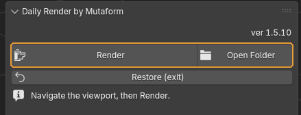{ .control-shot }

Before the studio is built there is a single **Setup Render Scene** button. Afterwards, **Render** and **Open Folder**.

**When you need it.** The working order: Setup → find your angle with the viewport → Render. No camera to place: the add-on creates one from the current view and removes it after the shot.

**What happens.** Setup builds the studio — HDRI light, one material, a contact shadow catcher, post-processing. The viewport switches to Rendered and shows a guide for the frame; anything outside it will not be in the shot. Render saves an auto-numbered PNG with a transparent background without moving your view. Open Folder opens the folder holding the results.

!!! warning "Worth knowing"
    Setup picks a fast configuration for the machine on its own: the best available backend, GPU only with no CPU hybrid, persistent data. All of it is restored on the way out.

### Restore (exit)

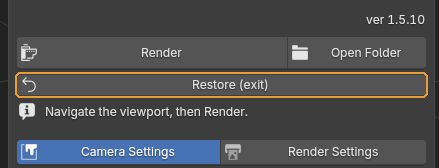{ .control-shot }

Rolls the scene back completely and leaves studio mode.

**When you need it.** When the shots are done. Nothing to fear: the add-on recorded the scene at Setup and puts exactly that back.

**What happens.** Everything created is removed; object materials, render settings and the device selection are restored.

### Camera Settings / Render Settings

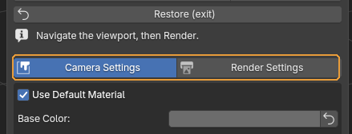{ .control-shot }

Switches the panel between the image and the technical side.

!!! warning "Worth knowing"
    Until the studio is built both tabs are greyed out. That is not a fault — there is nothing to configure without a scene.

## Camera Settings — how the shot looks

Everything that shapes the image: material, lens, light, colour grading.

### Use Default Material

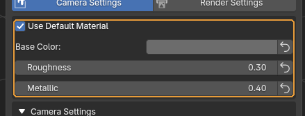{ .control-shot }

Renders everything with one studio material instead of the objects' own. Below it: colour, roughness and metallic.

**When you need it.** Leave it on for dailies: the model reads by form and silhouette rather than texture, and every asset in the feed looks consistent. Turn it off when the textures are the point.

**Default:** on

### Camera Settings (the fold)

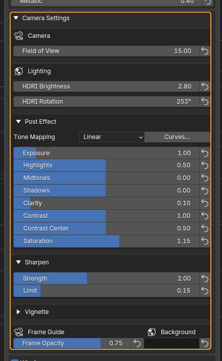{ .control-shot }

Opens the block holding the lens, lighting and post-processing.

**When you need it.** An ordinary daily needs none of it — the defaults are tuned for the studio look. Open it when a shot needs finishing.

**Default:** collapsed

### Field of View

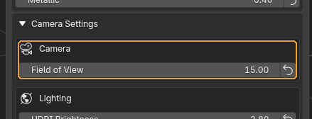{ .control-shot }

Vertical field of view, in degrees.

**When you need it.** A small value is a long-lens look with almost no perspective distortion — it is what makes the shot read as studio photography rather than a viewport grab. Raise it only when the asset does not fit or you want a deliberately wide look.

**Default:** 15°

### HDRI Brightness and HDRI Rotation

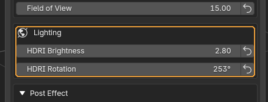{ .control-shot }

Environment brightness and its rotation about the vertical axis.

**When you need it.** Rotation is the quickest fix for a flat shot: the light direction and the highlights move while the model stays put. It updates live — turn it and watch.

### Post Effect (the fold)

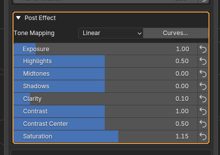{ .control-shot }

Opens the colour grading.

**Default:** expanded

### Tone Mapping and Curves

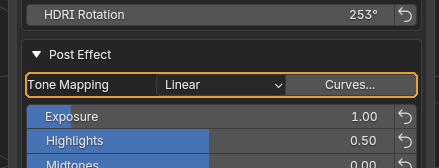{ .control-shot }

How luminance is mapped into the displayable range, plus a button for precise curves.

**When you need it.** Tone Mapping is rarely changed. Curves are for when the highlight and shadow sliders are not enough — lifting only the deepest darks, say.

### The grading sliders

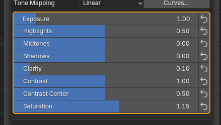{ .control-shot }

Exposure, highlights, midtones, shadows, local contrast, overall contrast with its pivot, and saturation.

**When you need it.** Clarity brings out mid-scale detail — the model looks crisper without touching sharpening. Contrast Center sets the luminance the contrast opens around: lower it when the shadows crush to black.

!!! warning "Worth knowing"
    Every row has an arrow button on the right that resets it. The defaults here are the studio's reference values, not Blender's factory ones, so resetting is safe.

### Sharpen

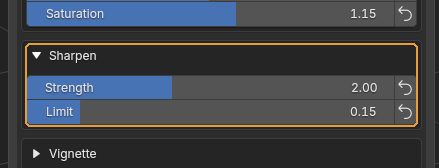{ .control-shot }

Sharpening with a limiter.

**When you need it.** Strength adds bite, Limit keeps bright halos from forming along contours. When a white fringe appears around the model, lower Limit rather than Strength.

### Frame Guide and Background

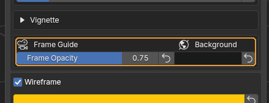{ .control-shot }

On the left, how much everything outside the frame is dimmed; on the right, the preview backdrop colour.

**When you need it.** The frame guide lets you compose in the viewport: what is dimmed will not be in the shot.

!!! warning "Worth knowing"
    The background colour only shows in the preview. The saved PNG is transparent and the contact shadow lands in the alpha, so the shot composites onto any background. The collapsed Vignette fold, with strength and softness, lives here too.

### Wireframe

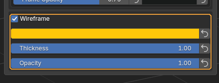{ .control-shot }

Lays the model's topology over the shading. Below: line colour, thickness and opacity.

**When you need it.** For a daily that needs to show topology. The wireframe follows the real quads, without triangulation diagonals — it shows what you modelled.

**Default:** off

## Render Settings — the technical side

Engine, frame size, quality and where files go.

### Cycles / EEVEE

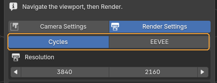{ .control-shot }

The engine used for both the preview and the saved frame.

**When you need it.** EEVEE is the quick look while you hunt for an angle on a heavy scene. Take the final frame in Cycles.

**Default:** Cycles

!!! warning "Worth knowing"
    EEVEE has no ground shadow: the transparent shadow catcher is a Cycles feature. The model floats in empty space, and that is not a fault.

### Resolution

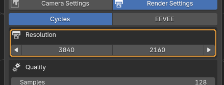{ .control-shot }

Frame size, with two arrow buttons: halve and double.

**When you need it.** The arrows preserve the aspect ratio, so the frame guide does not jump. Halve it while looking for an angle and restore it before the final shot.

**Default:** 3840 × 2160

### Samples, Denoiser, Ground Shadow

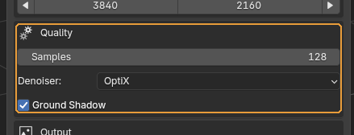{ .control-shot }

Sample count, denoiser and the ground shadow.

**When you need it.** The default sample count is enough for a daily. Raise it only when noise shows in the shadows of the final frame.

**Default:** 128 samples, OptiX, shadow on.

!!! warning "Worth knowing"
    Without an NVIDIA card the OptiX denoiser falls back to OpenImageDenoise on its own — nothing to choose.

### Output Folder and Name

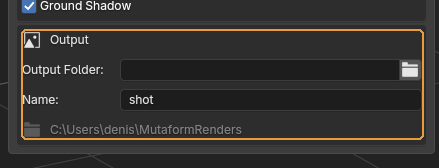{ .control-shot }

Where frames are saved and the base of their file name.

**When you need it.** Leave the folder empty and the add-on creates `renders` next to the file, showing the resolved path in grey under the fields so you can see where things will land.

**Default:** name `shot`; folder empty.

!!! warning "Worth knowing"
    The name gets auto-numbering appended, so earlier frames are never overwritten.

---

*Assembled from `content/qc-daily-render.en.yml`. Screenshots taken in **QC Daily Render 1.5.10**.*
