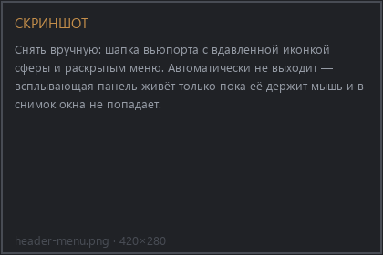
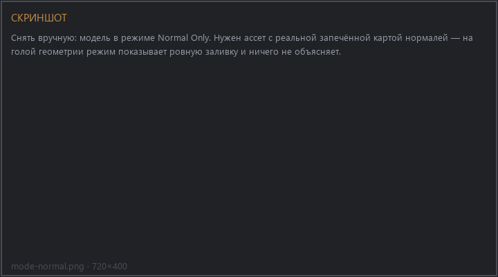

# QC Maya Viewport

Диагностическое отображение вьюпорта: посмотреть на модель так, как её видит
движок, и поймать проблемы запечённых карт до того, как они уедут дальше.

Аддон не живёт в N-панели. Он добавляет иконку сферы в шапку 3D-вьюпорта —
она включает режим, а стрелка рядом раскрывает меню с настройками.

{ .screenshot }

## Установка

1. `Edit → Preferences → Get Extensions`
2. Шестерёнка → `Repositories` → `+` → `Add Remote Repository`
3. Ссылка:

    ```text
    https://mutaform.github.io/qc-maya-viewport/index.json
    ```

Нужен Blender 5.1 или новее.

## Режимы

| Режим | Что показывает | Зачем |
| --- | --- | --- |
| **Normal Only** | только карту нормалей, без освещения | видно швы, градиенты по границам UV, артефакты клетки |
| **Normal + AO** | нормаль вместе с затенением | ближе всего к виду в движке |
| **AO Only** | только затенение | читается форма и объём, текстура не отвлекает |
| **Default Material** | единый серый материал | чистый силуэт и топология, без карт |

Режимы переключаются кнопками в меню; активный вдавлен.

{ .screenshot }

## Соглашение о нормалях

Внизу меню — переключатель **OpenGL / DirectX**. Это направление зелёного
канала карты нормалей:

- **OpenGL** — Y вверх. Так работают Blender, Marmoset, Unreal.
- **DirectX** — Y вниз. Так по умолчанию у Unity и у части внутренних движков.

Если выбрано неверное, выпуклости на модели читаются как вмятины. Это первое,
что нужно проверить, когда рельеф выглядит вывернутым наизнанку.

!!! warning "Совпадать должно с движком, а не с ощущением"
    Переключатель меняет только отображение в Blender. Если карта запечена в
    одном соглашении, а движок ждёт другое, править надо запекание, а не эту
    кнопку.

## Перезапекли текстуры

**Reimport Textures** перечитывает карты с диска. Blender держит текстуры в
кеше и сам изменения не подхватывает, поэтому после перезапекания во внешней
программе картинка во вьюпорте остаётся старой, пока не нажать эту кнопку.

## Что дальше

[Справочник интерфейса](reference.md).
