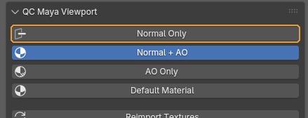
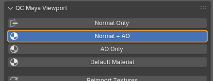
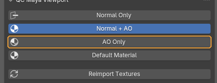
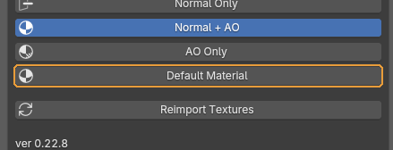
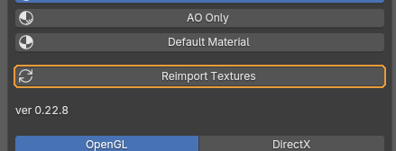
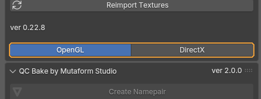

# What every button does

The add-on does not live in the sidebar: a sphere icon in the 3D viewport header toggles the mode, and the arrow beside it opens the menu with the settings. The screenshots below show that menu's contents. A popover cannot be captured in a window screenshot — it only exists while the mouse holds it open — so the same set of buttons was rendered in a side panel instead. Order, labels and appearance are identical; only the frame around them differs.

## Display modes

Four mutually exclusive modes. The active one stays depressed.

### Normal Only

{ .control-shot }

Shows the normal map alone, unlit.

**When you need it.** The main mode for signing off a baked normal. Without light you see what shading usually hides: seams along UV borders, gradients from a bad cage, artefacts where the high poly intersected itself.

!!! warning "Worth knowing"
    If the relief reads inside-out — bumps looking like dents — the map is not at fault; the convention is. The toggle is at the bottom of the menu.

### Normal + AO

{ .control-shot }

Normals together with occlusion.

**When you need it.** Closest to how the model will look in the engine. Good for the final look once the normal has been checked in Normal Only.

### AO Only

{ .control-shot }

Occlusion alone, no maps.

**When you need it.** When you need to judge form and volume and the texture is a distraction. Dents and areas where the high poly did not transfer show up clearly.

### Default Material

{ .control-shot }

One flat grey material: no normals, no occlusion.

**When you need it.** Clean silhouette and topology — the same view as a clay render. If the form is bad, no map will save it.

## The rest of the menu

### Reimport Textures

{ .control-shot }

Re-reads the textures from disk.

**When you need it.** After every re-bake in an external application. Blender caches textures and does not notice the change on its own: the viewport keeps showing the old image, and it is easy to spend half an hour studying an artefact that is already gone.

### OpenGL / DirectX

{ .control-shot }

The direction of the normal map's green channel.

**When you need it.** Set whatever your engine expects. **OpenGL** is Y up: Blender, Marmoset, Unreal. **DirectX** is Y down: Unity's default and some in-house engines.

**Default:** OpenGL

!!! warning "Worth knowing"
    The toggle only changes the display inside Blender. If the map was baked in one convention and the engine expects the other, the fix belongs in the bake. This button is here so you can look at the map the way the engine will.

---

*Assembled from `content/qc-maya-viewport.en.yml`. Screenshots taken in **QC Maya Viewport 0.22.8**.*
