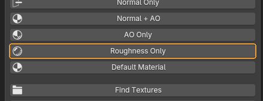
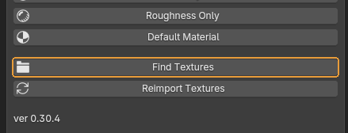
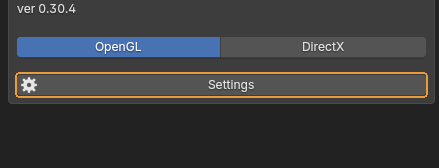

# What every button does

The add-on does not live in the sidebar: a sphere icon in the 3D viewport header toggles the mode, and the arrow beside it opens the menu with the settings. The screenshots below show that menu's contents. A popover cannot be captured in a window screenshot — it only exists while the mouse holds it open — so the same set of buttons was rendered in a side panel instead. Order, labels and appearance are identical; only the frame around them differs.

## Display modes

Five mutually exclusive modes. The active one stays depressed.

### Normal Only

{ .control-shot }

Shows the normal map alone, unlit.

**When you need it.** The main mode for signing off a baked normal. Without light you see what shading usually hides: seams along UV borders, gradients from a bad cage, artefacts where the high poly intersected itself.

!!! warning "Worth knowing"
    If the relief reads inside-out — bumps looking like dents — the map is not at fault; the convention is. The toggle is at the bottom of the menu.

### Normal + AO

{ .control-shot }

Normals together with occlusion.

**When you need it.** Closest to how the model will look in the engine. Good for the final look once the normal has been checked in Normal Only.

### AO Only

{ .control-shot }

Occlusion alone, no maps.

**When you need it.** When you need to judge form and volume and the texture is a distraction. Dents and areas where the high poly did not transfer show up clearly.

### Roughness Only

{ .control-shot }

Shows the roughness map flat — no light, no normal, no colour.

**When you need it.** When the model has an unexpected highlight, or a dead matte patch, and you need to know where it comes from. Under normal shading roughness is mixed into light and form, and cannot be read on its own.

**What happens.** The right channel is pulled out for you: from a packed `_ORM`, `_MRO` or `_spec` map its roughness channel, from an `_NRM` map the blue one. A material with no roughness at all reads as mid grey rather than white, so "roughness 1.0" and "no map" stay distinguishable.

### Default Material

{ .control-shot }

One flat grey material: no normals, no occlusion.

**When you need it.** Clean silhouette and topology — the same view as a clay render. If the form is bad, no map will save it.

## Textures

The add-on does not only show maps, it can wire them up. Both buttons sit in the menu right below the modes.

### Find Textures

{ .control-shot }

Picks textures out of a folder and wires them into the Principled BSDF, reading the suffixes in their filenames.

**When you need it.** When an asset arrives with a set of maps and you want to see it assembled without placing nodes by hand. Select the object, pick a material slot and press it — a file browser opens.

**What happens.** The browser opens on that asset's own folder rather than wherever it was last. Blender throws the import path away, so the add-on solves it from both ends: anything imported from now on gets stamped with its path, and whatever is already in the scene is found by name under the **Project Roots** you set in Settings. If the asset turns up inside a `Meshes` subfolder, the add-on climbs out to the folder that really holds the maps. From there the maps go where they belong: data maps get Non-Color, the normal goes through a Normal Map node, height through a Bump node, and packed `_ORM`-style maps are split into channels. Textures already wired up are repointed rather than duplicated, so a second run multiplies nothing.

!!! warning "Worth knowing"
    Four checkboxes sit on the right of the browser. **Search Subfolders** looks inside folders below the chosen one. **Match Material Name** takes only files whose name resembles the material — turn it off when the folder holds a single set under a different name. **All Material Slots** fills every material on the object, not just the active one. **Normal Convention From Name** switches the convention when the filename spells it out. Utility maps are deliberately left alone: `_cc` (a tint mask), `_curve`, `_cavity`, `_thickness`, `_objid`, `_matid`, `_position`, `_id`, and object-space normal bakes. A full-size file beats its own copy in a subfolder such as `1k`.

### Reimport Textures

{ .control-shot }

Re-reads the textures from disk.

**When you need it.** After every re-bake in an external application. Blender caches textures and does not notice the change on its own: the viewport keeps showing the old image, and it is easy to spend half an hour studying an artefact that is already gone.

## The rest of the menu

### OpenGL / DirectX

{ .control-shot }

The direction of the normal map's green channel.

**When you need it.** Set whatever your engine expects. **OpenGL** is Y up: Blender, Marmoset, Unreal. **DirectX** is Y down: Unity's default and some in-house engines. If the relief reads inside out — bumps looking like dents — this is where to start.

**What happens.** It switches more than the diagnostic modes: every Normal Map node in the scene's materials moves with it, node groups included. So an ordinary EEVEE or Cycles render agrees with the QC viewport instead of disagreeing with it. The change is a normal edit and undoes with ++ctrl+z++. Turning the viewer on does the reverse: the convention is read off the scene's nodes, so the two never start out disagreeing.

**Default:** OpenGL

!!! warning "Worth knowing"
    This is a way to look at the map the way the engine will, not a way to repair one baked wrong. If the map was baked in one convention and the engine expects the other, the fix belongs in the bake.

### Settings

{ .control-shot }

Opens the suffix table: which tail in a filename counts as which map.

**When you need it.** When a project has its own naming and Find Textures does not recognise every map. A row can be edited, added, or deleted — a deleted rule really does stop matching.

**What happens.** The table ships with 104 built-in rules and a button to reset to them. It lives in the Blender preferences rather than the scene file, so it survives a restart and applies to every scene on the machine. **Project Roots** — the folders Find Textures searches an asset by name under — are set here too.

!!! warning "Worth knowing"
    The dialog says whether the table is being saved. With Auto-Save Preferences off it also offers a **Save Preferences** button; without it the edit is dropped when Blender exits.

---

*Assembled from `content/qc-maya-viewport.en.yml`. Screenshots taken in **QC Maya Viewport 0.30.4**.*
