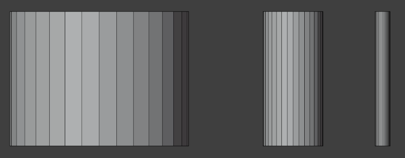
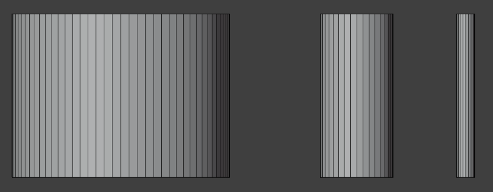
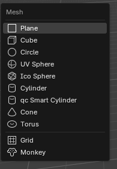
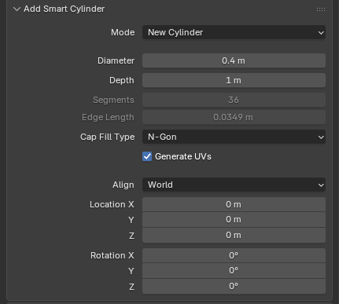
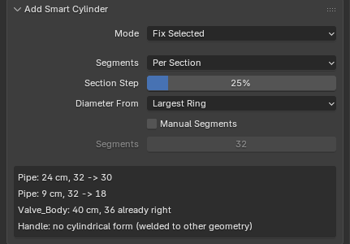
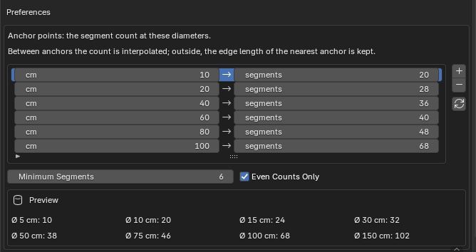

# QC Smart Cylinder

A cylinder whose segment count is not guessed but computed from its diameter by
the studio's low-poly rule. The same tool also rebuilds cylindrical forms that
already exist — yours and other people's.

How to install it is on its own page:
**[Installation](install.en.md)**.

## Why it exists

The built-in Cylinder always gives 32 segments, whatever the diameter. On a
bolt that is four times more than needed; on a barrel, half of what it wants.
Put three cylinders side by side and the wireframe says it at once:

{ .screenshot }

The same three after the add-on rebuilt them — 82, 36 and 20 segments:

{ .screenshot }

The idea behind the rule is to **keep the edge length roughly constant**
whatever the size of the part. Then the mesh density across a scene looks even,
and the silhouette breaks neither on the small parts nor on the big ones.

## Where it lives

One item in the ++shift+a++ → **Mesh** menu, directly under the ordinary
**Cylinder**.

{ .screenshot }

The add-on has no panel of its own: everything it lets you set lives in the
**Adjust Last Operation** box — the one that opens in the bottom-left corner of
the viewport after an action, or with ++f9++.

## A new cylinder

Call the menu item with nothing selected and a cylinder appears at the 3D
cursor.

{ .screenshot }

The field to work with is **Diameter**: drag it and **Segments** recomputes as
you go. Segments and Edge Length cannot be edited — they are the rule's answer,
not a setting.

The diameter is a diameter, not a radius, as in the studio table. Type any unit
you like: enter `40 cm` and Blender converts it. The scene scale is honoured.

!!! note "The edge length is not decoration"
    It tells you whether the rule is working or you have wandered off the end
    of the table. At any sensible diameter it stays between roughly 1.5 and
    5 cm. If it jumps, look at the diameter: the scene units are probably not
    what you think they are.

## Rebuilding what is already there

Select a mesh and call the same menu item — the add-on works out that you do
not mean a new cylinder, and rebuilds the selection instead.

{ .screenshot }

The heart of it is **Per Section**. A part of changing diameter does not get
one count along its whole length: the add-on splits it into sections where the
diameter changes, gives each the count its own diameter calls for, and stitches
neighbouring sections together with triangle bridges. A lathed part, a pipe
with a reduction, a rod with a thicker end — all handled in one call.

What survives the rebuild:

- **the unwrap** — UVs are carried over to the new mesh, elbows and caps
  included;
- **anything that is not a form** — the part of the mesh the add-on did not
  recognise is left alone;
- **edit mode** — Fix Selected works in Edit Mode too, and a partial vertex
  selection limits the repair to the forms it touches.

## The report

After a rebuild the box shows one line per form it found.

Worth reading always, not only when something went wrong:

| Line | What it means |
| --- | --- |
| `40 cm, 36 → 82` | The diameter, the count before and after |
| `36 already right` | The form was correct and was left alone |
| `no cylindrical form` | The add-on recognised nothing — and broke nothing |

## The rule lives in the preferences

The table itself is in `Edit → Preferences… → Add-ons → QC Smart Cylinder`.

{ .screenshot }

The rows are anchor points, not ranges: between them the count is interpolated,
so there are more steps than rows. Outside the table the edge length of the
nearest anchor is kept.

The studio values: 10 cm → 20, 20 → 28, 40 → 36, 60 → 40, 80 → 48, 100 → 68.
The arrow button always brings them back.

!!! warning "The table is shared by every scene"
    It lives in Blender's preferences, not in the scene file. Tailor it to one
    project and the next project on the same machine sees the same numbers.

## What it does not do

The limits are known and deliberate — in these cases the add-on skips the form
and says so in the report, rather than guessing at the geometry:

- a form **welded** to the rest of the geometry;
- a mesh with **shape keys**;
- a closed ring of sections — a torus made of pieces of differing thickness,
  say;
- a four-sided cylinder: it cannot be told apart from a cube. If one really
  does need rebuilding, set the count with **Manual Segments**.

## Next

The [settings reference](reference.en.md).
