# Что делает каждая кнопка

У аддона нет своей панели: он добавляет один пункт в меню `Add > Mesh`, а все настройки живут в панели **Adjust Last Operation** — той, что раскрывается в левом нижнем углу вьюпорта после действия или по ++f9++. Панель показывает разный набор настроек в зависимости от того, что аддон делает: строит новый цилиндр или перестраивает выделенный. Ниже разобраны оба набора и таблица правила из настроек аддона.

## Где он лежит

Один пункт, сразу под встроенным Cylinder.

### Add → Mesh → qc Smart Cylinder

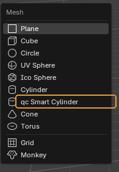{ .control-shot }

Единственная точка входа. Пункт стоит **строго под встроенным Cylinder**, чтобы рука шла туда же, куда и раньше.

**Когда пригодится.** Что произойдёт по нажатию, зависит от выделения. Ничего не выделено — появится новый цилиндр в 3D-курсоре. Выделен меш с цилиндрической формой — аддон перестроит его. Режим потом можно переключить в панели Adjust Last Operation.

!!! warning "Обратите внимание"
    Если выделено что-то, в чём цилиндрической формы нет, аддон **не** создаст неожиданный цилиндр рядом, а напишет причину в отчёте.

## New Cylinder — новый цилиндр

Настройки в панели Adjust Last Operation, когда выбран режим **New Cylinder**. Диаметр меняется — число сечений пересчитывается тут же.

### Mode

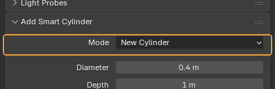{ .control-shot }

Переключатель между **New Cylinder** и **Fix Selected**.

**Когда пригодится.** Когда аддон угадал не то. Например, выделен цилиндр, но нужен не ремонт старого, а новый рядом: переключите на New Cylinder прямо в панели, не снимая выделения.

**По умолчанию:** выбирается сам по выделению в момент вызова

### Diameter

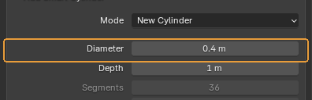{ .control-shot }

Диаметр цилиндра — не радиус. Из него и считается число сечений.

**Когда пригодится.** Главное поле режима New. Вводить можно в любых единицах: наберите `40 cm`, и Blender переведёт сам. Масштаб сцены (`Scene → Units → Unit Scale`) аддон учитывает — правило считает по настоящим сантиметрам, а не по условным единицам.

**По умолчанию:** `0.4 m`, то есть 40 см — по таблице 36 сечений.

### Depth

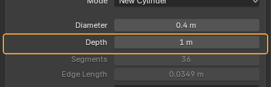{ .control-shot }

Высота цилиндра.

**Когда пригодится.** На число сечений не влияет никак: правило смотрит только на диаметр.

**По умолчанию:** `1 m`

### Segments и Edge Length

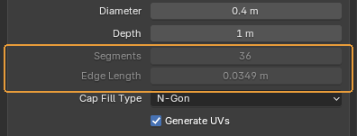{ .control-shot }

Два поля, которые нельзя редактировать: сколько сечений выдало правило и какой длины получилось ребро.

**Когда пригодится.** Это способ увидеть, что правило вообще делает. Потяните диаметр — число сечений пойдёт ступенями, а длина ребра останется примерно на месте. Ради этого таблица и заведена: ребро одной длины на мешах любого размера.

!!! warning "Обратите внимание"
    Длина ребра — настоящая хорда между соседними вершинами, а не длина дуги.

### Cap Fill Type

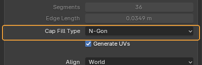{ .control-shot }

Чем закрыты торцы: **N-Gon**, **Triangle Fan** или ничем.

**Когда пригодится.** То же самое, что у встроенного Cylinder, и означает то же самое. N-Gon — обычный выбор для лоуполи: одна грань, которую легко выделить и подрезать.

**По умолчанию:** N-Gon

### Generate UVs

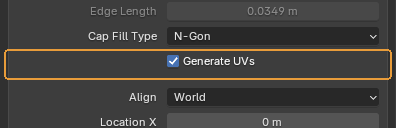{ .control-shot }

Сразу сделать простую развёртку.

**Когда пригодится.** Оставляйте включённым: развёртка всё равно понадобится, а пустой меш без UV-слоя потом легко проскочить мимо запекания.

**По умолчанию:** включено

### Align, Location, Rotation

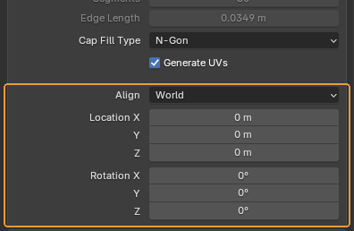{ .control-shot }

Где и как встанет новый цилиндр.

**Когда пригодится.** Стандартный блок Blender, одинаковый у всех примитивов. **Align: View** ставит цилиндр лицом к камере, **3D Cursor** — по повороту курсора.

**По умолчанию:** `Align: World`, положение — 3D-курсор.

## Fix Selected — перестройка выделенного

Тот же оператор, но вместо нового цилиндра он перестраивает уже существующие формы. Аддон сам переключается в этот режим, если при вызове что-то выделено.

### Segments — Per Section или Whole Form

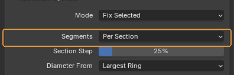{ .control-shot }

Считать число сечений отдельно для каждой секции формы или одно на всю форму целиком.

**Когда пригодится.** **Per Section** — для деталей переменного диаметра: токарных, труб с переходами, стержней с утолщениями. Широкая часть получит больше сечений, узкая — меньше, между ними аддон построит треугольные мосты. **Whole Form** — когда деталь должна остаться одним ровным цилиндром без переходов. Число берётся с одного кольца, выбранного ниже.

**По умолчанию:** Per Section

### Section Step

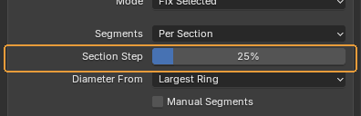{ .control-shot }

Насколько должен измениться диаметр между соседними кольцами, чтобы аддон счёл это началом новой секции.

**Когда пригодится.** Появляется только в режиме Per Section. Секций получилось слишком много — поднимите значение, деталь разбилась грубее, чем надо — опустите.

**По умолчанию:** 25 %

!!! warning "Обратите внимание"
    Плоская ступенька между двумя радиусами начинает новую секцию всегда, независимо от этого числа.

### Diameter From

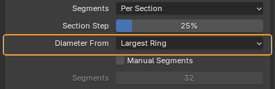{ .control-shot }

Какое кольцо задаёт диаметр секции, когда кольца в ней разного размера: **Largest Ring**, **Average Ring** или **Smallest Ring**.

**Когда пригодится.** По умолчанию решает самое широкое кольцо — так силуэт в самом заметном месте останется гладким. Average пригодится на длинных конусах, где верхнее кольцо намного уже нижнего и «по самому широкому» выходит избыточно.

**По умолчанию:** Largest Ring

### Manual Segments

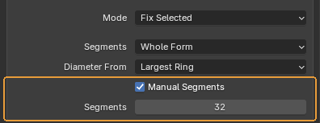{ .control-shot }

Отменить правило и перестроить с тем числом, которое введено руками.

**Когда пригодится.** Для случаев, где правило не при чём: соседняя деталь уже собрана на 24 сечениях, и новую надо подогнать под неё. Или форма, которую аддон пропустил как неоднозначную, — число можно назначить силой.

**По умолчанию:** выключено

!!! warning "Обратите внимание"
    Поле числа серое, пока галочка снята: это не сломано, так видно, что значение сейчас ни на что не влияет.

### Отчёт

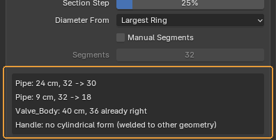{ .control-shot }

Построчно: что аддон нашёл и что с этим сделал. По строке на форму.

**Когда пригодится.** Читать всегда, а не только когда что-то пошло не так. `40 cm, 36 → 82` — диаметр, было и стало; `already right` — форма и так правильная, её не трогали; `no cylindrical form` — аддон ничего не узнал и **ничего не испортил**; `capped: check the object scale` — число упёрлось в потолок из настроек, и это почти всегда неверный масштаб объекта, а не исполинская деталь.

!!! warning "Обратите внимание"
    Строк показывается не больше двенадцати, остальные сворачиваются в «… and N more». Не узнаны бывают формы, приваренные к остальной геометрии, меши с shape keys и замкнутые кольца секций — это известные границы, а не поломка.

## Настройки аддона

`Edit → Preferences… → Add-ons → QC Smart Cylinder`. Здесь лежит само правило: по какой таблице считается число сечений.

### Таблица опорных точек

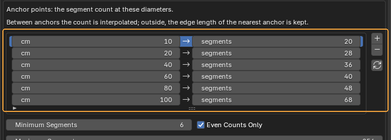{ .control-shot }

Само правило: при каком диаметре сколько сечений. Строки — опорные точки, а не диапазоны.

**Когда пригодится.** Между точками число интерполируется, поэтому ступеней получается больше, чем строк: 15 см → 24, 30 → 32, 50 → 38. За краями таблицы держится длина ребра крайней точки — ниже 10 см число падает пропорционально диаметру, выше 100 см так же растёт.

**Что получится.** Кнопки справа: **+** добавляет точку на 10 см выше самой большой, **–** удаляет выбранную, круговая стрелка возвращает студийную таблицу. Правка действует сразу и на новые цилиндры, и на перестройку — правило читается при каждом вызове.

**По умолчанию:** студийная таблица: 10 см → 20, 20 → 28, 40 → 36, 60 → 40, 80 → 48, 100 → 68.

!!! warning "Обратите внимание"
    Таблица живёт в настройках Blender, а не в файле сцены: она общая для всех сцен на этой машине и переживает перезапуск. Если правите таблицу под конкретный проект, помните, что соседний проект на той же машине увидит те же значения.

### Minimum, Maximum Segments и Even Counts Only

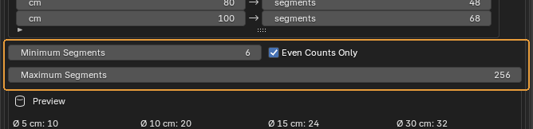{ .control-shot }

Границы числа сечений снизу и сверху и округление до чётного.

**Когда пригодится.** Минимум держит совсем мелкие детали от вырождения: без него правило на диаметре 2 см выдало бы четырёхгранник. Чётность нужна, чтобы цилиндр остался симметричным по обеим осям — так его проще резать пополам и зеркалить.

**Что получится.** Максимум — страховка от неверного масштаба. Ассет, у которого сантиметры прочитаны как метры, даёт кнопку «диаметром» в двадцать метров, и правило честно насчитывает ей больше тысячи сечений на кольцо. Теперь такая форма упирается в потолок, а в отчёте появляется `capped: check the object scale`.

**По умолчанию:** минимум 6, максимум 256, чётность включена

!!! warning "Обратите внимание"
    На **Manual Segments** потолок не действует: если число назначено руками, значит его и хотели.

### Preview

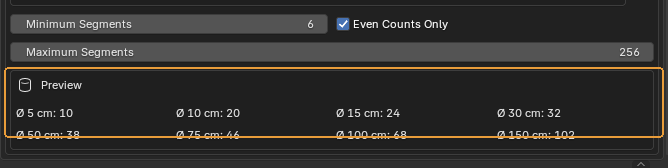{ .control-shot }

Что правило выдаёт на восьми характерных диаметрах.

**Когда пригодится.** Проверять правку, не выходя из настроек: поправили точку — строчка пересчиталась. Быстрее, чем строить пробные цилиндры.

---

*Страница собрана из файла `content/qc-smart-cylinder.ru.yml`. Снимки сделаны в **QC Smart Cylinder 1.6.2**.*
