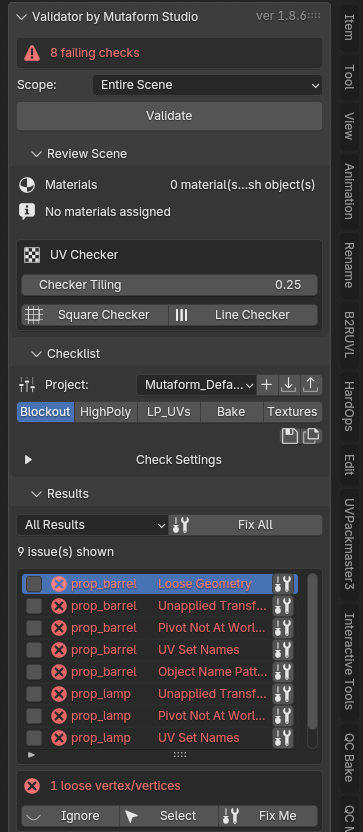
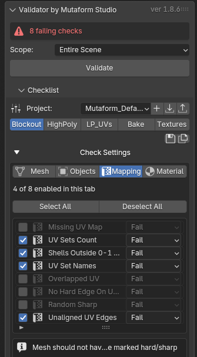
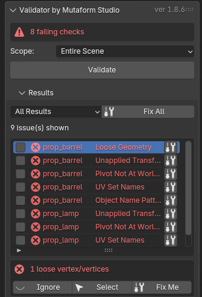
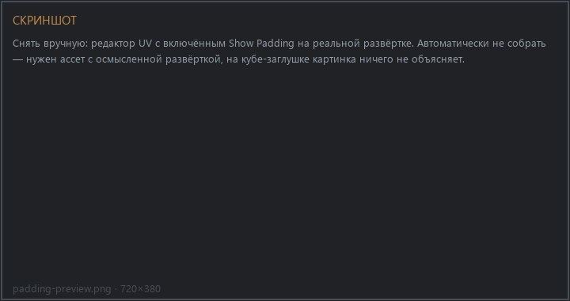

# Scene QC Validator

A checklist of scene checks to run before handing work off. The add-on puts a
model through a set of rules — topology, transforms, UVs, materials, naming —
and hands back a list of what needs fixing. Some of it is fixed with one button.

The core idea: there is no single set of checks for every situation. Each stage
of the work gets its own. Demanding clean UVs during blockout is pointless;
demanding them before texturing is mandatory.

{ .screenshot }

## Installation

1. `Edit → Preferences → Get Extensions`
2. Gear icon → `Repositories` → `+` → `Add Remote Repository`
3. The URL:

    ```text
    https://mutaform.github.io/qc-validator/index.json
    ```

4. Find `Scene QC Validator` and install it

Panel: press ++n++ in the 3D viewport → **QC Validator** tab. Requires Blender
4.5 or newer.

## First run

A fresh file has no checklist — the panel offers only **Initialize Checklist**.
Press it once and the checks appear, populated from the default project.

After that the order is:

1. Pick a **Scope** — what to check.
2. Apply the stage matching where you are in the work.
3. Press **Validate**.
4. Work through the results.

## Scope

| Scope | What gets checked |
| --- | --- |
| Selection | selected meshes only |
| Visible Scene | every visible mesh in the active scene |
| Entire Scene | every mesh, hidden ones included |

Selection is the default. It is noticeably faster on a heavy scene, and you are
usually working on one asset anyway.

## Stages

A stage is a saved set: which checks are on, at what severity, with which
parameters. Stages are grouped into a project. The add-on ships with the
`Mutaform_Default` project and five stages. It is not a ladder of strictness:
each stage asks what belongs to its step of the job and stays quiet about the
rest.

| Stage | Checks | What it covers |
| --- | --- | --- |
| Blockout | 14 | geometry rubbish, transforms, object and UV-set names, material count. The layout itself is not asked for yet |
| HighPoly | 9 | the loosest of all. A sculpt is asked for names, transforms and duplicate faces: open shells, degenerate and concave faces are normal there |
| LP_UVs | 25 | the full set: topology, the whole UV layout, materials, Nanite |
| Bake | 24 | the same, minus Nanite Closed Geometry |
| Textures | 25 | the same set as LP_UVs |

The stages are the row of buttons under the Project line. Pressing one applies
it: checks toggle, parameters fill in.

!!! note "A stage clears what it does not need"
    Every stage of the bundled project lists all 27 checks, so switching does
    not accumulate whatever the previous step had on: what a stage does not
    want, it turns off. Your own project need not work that way — a check a
    stage does not mention stays exactly as it was found.

## Where the checklist actually is

!!! warning "The check list is collapsed by default"
    Below the stage buttons there is a **Check Settings** row with an arrow.
    While it is collapsed the checks themselves are not visible at all — only
    the project and stage pickers. This is the first thing people trip over: it
    looks as though there is no checklist.

Expand it and you get the **Mesh / Objects / Mapping / Material** tabs, a count
of enabled checks on the current tab, Select All and Deselect All, the list
itself with a checkbox and severity per check, and below the list a description
of the selected check plus its parameters.

{ .screenshot }

!!! tip "Your own set"
    Tuned the checklist for a specific job? Save it as a stage (**Save Stage**)
    or as a whole project (**Save Project**). User projects live in the
    extension's folder and never clash with the bundled ones — a bundled
    project cannot be overwritten.

    To hand a set to someone else use **Export Project**, which produces a JSON
    file. On their machine, **Import Project**.

## Reading the results

After **Validate** the status bar at the top gives the verdict: either "all
checks passed" or the number of blocking problems.

Every check carries a severity:

- **Fail** — blocks until fixed;
- **Info** — reports without spoiling the verdict.

Severity is per-check and set in the checklist. If a check is desirable but not
mandatory in your pipeline, move it to Info rather than switching it off — that
way it stays visible.

{ .screenshot }

Clicking a result row selects the object and drops into edit mode with the
offending vertices, edges or faces selected — when the check recorded where the
problem was.

### Silencing a problem

The **Ignore** button on the row. A silenced problem stops affecting the verdict
and survives re-running `Validate` — the ignore list is stored in the scene,
separately from the results.

An ignore is bound to the pair "object + check". Rename the object and the
ignore no longer applies.

## Auto-fixing

**Fix Me** handles one row, **Fix All** every row that has a fix.

!!! warning "Some fixes change geometry"
    The [reference](reference.en.md) marks, per check, whether its fix is
    destructive. Triangulating n-gons, deleting degenerate faces, applying
    transforms — those modify the model, they do not merely flag it.

    Fix All walks the list in order and takes a while on a heavy scene, which is
    why it shows progress. **Run Validate again afterwards**: some fixes surface
    new findings.

Checks without a fix are the ones where the right answer depends on the job.
`Pivot Not Centered`, for instance: where the pivot belongs depends on how the
asset is placed in the level, and the add-on does not guess.

## Inspecting UVs

Separate from the checklist there are interactive tools. They report nothing
into the results; they show you the state directly in the editor.

**Show Overlaps** highlights UVs sitting on top of each other, on the UV set
number you pick.

**Show Padding** shows what the gaps between islands become at a given texture
size. Change the texture size and the padding value is rescaled proportionally
so the ratio holds.

**Show Texel Density** colours objects by texel density, making the ones out of
scale obvious at a glance.

{ .screenshot }

!!! tip "One material, one texture set"
    All three tools look only at the active material's faces. Another
    material's islands are not drawn beside them, do not count as overlaps, and
    do not shift the average density Texel Density reads its colours against.

    On a multi-material model there is no other sensible answer: the
    neighbouring material leaves for its own texture, so measuring it alongside
    this one is pointless. Switch the active slot and the review re-aims by
    itself — no need to leave it.

    A review opened by clicking a result row is the exception: it shows the
    whole mesh, exactly what the check complained about.

!!! tip "Check All Material Users"
    All three tools have this checkbox and it matters more than it looks.
    Without it only the active object is inspected. With it, every visible mesh
    sharing the same material — that is, everything headed for the same atlas.

    Two objects can each be clean on their own and still overlap in the shared
    layout. Without this checkbox that never shows up.

**Toggle UV Checker** puts a checker texture on every material. The original
materials are not harmed — pressing it again puts everything back. Checker
density is adjustable live.

## Walking the materials

The **Review Scene** fold lists the materials in scope: how many objects and
slots each one has. Every row carries two actions.

**Clicking the material name** selects every object in the scene that uses it —
not only those inside the Scope. It also makes that material the active slot on
each of them, which leaves the inspection tools aimed where they should be.

**The button on the right** is Review Material UVs. It opens multi-object Edit
Mode with only that material's faces selected, so the UV editor shows its layout
and nothing else. While the review runs, a `Reviewing <material>` line sits in
both Review Scene and Checklist. Pressing it again restores the selection, the
mode and UV sync as they were.

That walks an asset atlas by atlas: pick a material, look at overlaps, padding
and density, move to the next. Hidden and unselectable objects are skipped, and
the status line says how many.

## Next

The full list of 27 checks, with parameters and the destructive-fix flag, is in
the [interface reference](reference.en.md).
