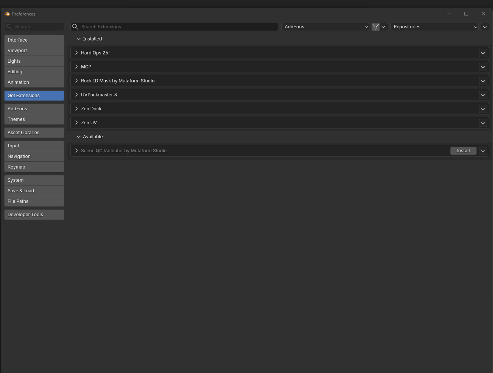

# Installation — Scene QC Validator

Set it up once; after that Blender offers updates on its own.

## What you need

Blender **4.5** or newer. The version is in the window title, and in
`Help → About Blender`.

## Step 1. Add the repository

This is done **once per machine**. Even if you have added a repository for
another Mutaform add-on, add this one too — each add-on has its own.

1. `Edit → Preferences…` opens Blender's preferences
2. Pick **Get Extensions** on the left
3. Click the gear icon in the top right corner → **Repositories**
4. In the window that opens click **+** → **Add Remote Repository**
5. Paste this into the **URL** field:

    ```text
    https://mutaform.github.io/scene-qc-validator/index.json
    ```

6. Tick **Check for Updates on Startup**
7. Press **Create**

The repositories window can be closed.

{ .screenshot }

The recording uses one of the add-ons as an example — the sequence of clicks is
the same for all of them, only the URL differs. Yours is the one in step 5 above.

## Step 2. Install the add-on

1. Still in **Get Extensions**, type into the search box at the top:

    ```text
    Scene QC Validator
    ```

2. The add-on appears in the list — press **Install** beside its name

That is it. Preferences can be closed.

## Step 3. Check that it worked

The panel appears in the 3D viewport: press ++n++ → the **QC Validator** tab.

If the panel is there, the installation is done.

## Updates

Blender checks for them at startup, because step 1 ticked **Check for Updates on
Startup**. A new version shows up in `Get Extensions` with an **Update** button.

To check by hand: `Get Extensions` → gear → **Check for Updates**.

The installed version is written on the right of the panel header, like
`ver 1.0.0`. It also tells you whether you are reading the right documentation —
the version switcher is in the header of this site.

## If it did not work

| What you see | What is wrong |
| --- | --- |
| The search finds nothing | The repository was not added, or the URL has a typo. Go back to step 1 and check the whole address |
| The add-on is listed but `Install` does nothing | Your Blender is older than **4.5**. Update Blender |
| It installed but there is no panel | Make sure you pressed ++n++ inside the viewport, and look through the tabs on the side: there can be many, and the one you want may be collapsed |
| The repository list is empty | No network access, or a proxy blocks it. Ask the studio for the archive and install from file: `Get Extensions` → the `▼` icon top right → **Install from Disk…** |

!!! tip "First run"
    A new file has no checklist yet — the panel shows only an
    **Initialize Checklist** button. Press it once and the checks appear.

## Next

What the add-on does is in the [overview](index.en.md). Every button is broken
down in the [reference](reference.en.md).
