# Что делает каждая кнопка

Здесь разобран каждый элемент панели QC Validator, ниже — таблица всех проверок, а в конце показано, как проверки выглядят на настоящей модели.

## Верх панели

То, что видно всегда: область действия, кнопка запуска и полоса состояния над ними.

### Scope

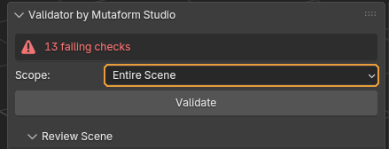{ .control-shot }

Какие объекты попадут в проверку.

**Когда пригодится.** Оставляйте Selection, пока работаете над одним ассетом: на тяжёлой сцене это заметно быстрее. Visible Scene и Entire Scene нужны перед сдачей, когда надо убедиться, что в файле не осталось забытого мусора. Разница между ними одна: Entire Scene смотрит и скрытые объекты тоже.

**По умолчанию:** Selection — только выделенные меши.

### Validate

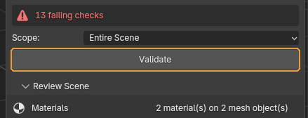{ .control-shot }

Прогоняет все включённые проверки и заполняет список результатов.

**Когда пригодится.** После каждого заметного шага работы, а не один раз перед сдачей: чем раньше поймана проблема, тем дешевле её чинить.

**Что получится.** Полоса состояния над кнопкой становится зелёной («All checks passed») или красной с числом блокирующих проблем. Ниже, в свитке Results, появляется список.

!!! warning "Обратите внимание"
    В новом файле чек-листа ещё нет, и вместо Validate панель показывает кнопку **Initialize Checklist**. Нажмите её один раз — проверки заведутся из активного проекта, и дальше кнопка больше не появится.

## Results — разбор найденного

Список проблем после прогона. Пока Validate не нажимали, свиток пустой и сообщает об этом.

### Фильтр списка и Fix All

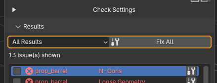{ .control-shot }

Слева — чем ограничить список на экране, справа — кнопка «починить всё, что чинится».

**Когда пригодится.** Фильтр удобен на длинном списке: **Fixable Only** оставляет то, что закроется автоматически, и сразу видно, сколько работы останется руками. Фильтр влияет только на показ — вердикт от него не меняется.

**Что получится.** Fix All идёт по списку и чинит всё подряд, показывая прогресс. На тяжёлой сцене это не мгновенно.

**По умолчанию:** All Results — показываются все строки.

!!! warning "Обратите внимание"
    После Fix All обязательно запустите Validate заново. Часть исправлений меняет геометрию, и на изменённой модели могут вылезти новые замечания — например, триангуляция n-гонов способна породить вырожденные грани.

### Список проблем

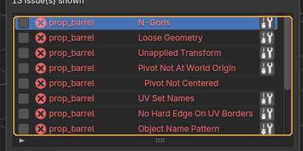{ .control-shot }

Каждая строка — одна проблема на одном объекте: имя объекта, название проверки и значок уровня.

**Когда пригодится.** Кликайте по строкам подряд. Клик не просто выделяет строку: аддон выделяет проблемный объект и переходит в режим редактирования с выделенными вершинами, рёбрами или полигонами — теми самыми, из-за которых проверка сработала.

!!! warning "Обратите внимание"
    Красный значок — Fail, блокирует сдачу. Серый перечёркнутый глаз — заглушённая строка, она на вердикт не влияет. Уровень задаётся для каждой проверки отдельно в чек-листе.

### Ignore / Select / Fix Me

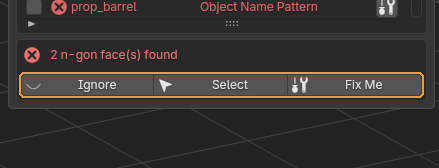{ .control-shot }

Действия над выбранной строкой. Над ними — текстовое пояснение, что именно нашла проверка.

**Когда пригодится.** **Select** возвращает выделение на проблемные элементы, если вы успели выделить что-то другое. **Fix Me** чинит только эту строку и появляется лишь у проверок, у которых автофикс есть. **Ignore** заглушает проблему.

**Что получится.** Заглушённая строка перестаёт влиять на вердикт и переживает повторный Validate: список заглушек хранится в сцене отдельно от результатов. Кнопка при этом меняется на Restore.

!!! warning "Обратите внимание"
    Заглушка привязана к паре «объект + проверка». Переименуете объект — она отвяжется, и проблема вернётся в список.

## Checklist — что именно проверять

Набор проверок хранится в проекте и разложен по стадиям работы. Здесь же живут инструменты осмотра развёртки, но появляются они не всегда — см. ниже.

### Строка Project

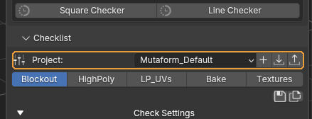{ .control-shot }

Выбор проекта и три кнопки справа: сохранить текущий набор как проект, загрузить проект из файла, выгрузить в файл.

**Когда пригодится.** Проект — это набор стадий. Свой проект заводят, когда правила отличаются от студийных: другое именование, другие допуски. Чтобы передать набор другому художнику, выгружаете в JSON, он у себя загружает.

!!! warning "Обратите внимание"
    Встроенный проект перезаписать нельзя — сохранение всегда создаёт пользовательскую копию в папке расширения. Так студийный набор не испортить случайно.

### Кнопки стадий

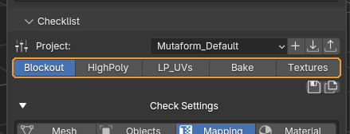{ .control-shot }

Ряд кнопок под строкой проекта. Каждая — сохранённый набор: какие проверки включены, с каким уровнем и какими параметрами.

**Когда пригодится.** Переключайте по мере работы. Стадия — это не «уровень строгости», а набор под конкретный этап: на Blockout включено 14 проверок, на HighPoly — 9, на LP_UVs — 25. HighPoly нарочно самая свободная: на скульпте незамкнутая сетка, вырожденные грани и вогнутые полигоны в порядке вещей, и придираться к ним рано. Требовать чистую развёртку на блокауте так же бессмысленно, а перед текстурированием — обязательно.

**Что получится.** Нажатие сразу применяет стадию: галочки в чек-листе переставляются, параметры подставляются. Активная стадия остаётся вдавленной.

!!! warning "Обратите внимание"
    Стадия LP_UVs — особая: только на ней в панели появляются три инструмента осмотра развёртки. На других стадиях их просто нет. Стадия переключает только те проверки, что в ней перечислены; остальные остаются как были. Во встроенном проекте перечислены все 27, поэтому переключение честно гасит лишнее и не тянет включённое с прошлой стадии. В своём проекте следите за этим сами: проверка, которую стадия не упоминает, останется в том состоянии, в каком её застали.

### Кнопки справа от стадий

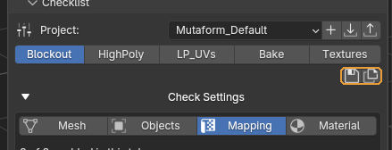{ .control-shot }

Мелкий ряд значков: записать текущее состояние чек-листа в стадию, сохранить весь проект копией, удалить стадию.

**Когда пригодится.** Настроили чек-лист под конкретную задачу и хотите вернуться к нему завтра — сохраните стадию.

!!! warning "Обратите внимание"
    Кнопка удаления есть только у пользовательских проектов: из встроенного стадию не убрать.

### Check Settings

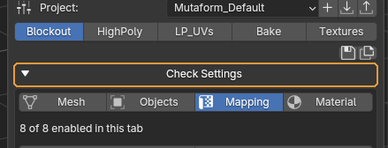{ .control-shot }

Раскрывает сам чек-лист.

**Когда пригодится.** Когда нужно включить или выключить отдельные проверки, поменять уровень или подкрутить параметр.

**По умолчанию:** свёрнуто

!!! warning "Обратите внимание"
    Это первое, обо что спотыкаются новички: пока строка свёрнута, проверок в панели не видно вообще — только выбор проекта и стадии. Кажется, что чек-листа нет.

### Вкладки Mesh / Objects / Mapping / Material

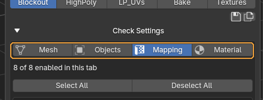{ .control-shot }

Делят проверки по типу: геометрия, объекты и трансформации, развёртка, материалы.

**Когда пригодится.** Просто чтобы не листать 26 строк подряд. Под вкладками написано, сколько проверок включено на текущей.

!!! warning "Обратите внимание"
    Вкладка меняет только показ. Validate всегда прогоняет все включённые проверки, а не только те, что открыты сейчас.

### Select All / Deselect All

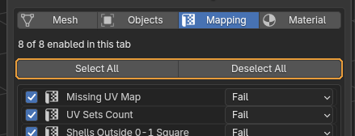{ .control-shot }

Включает или выключает разом все проверки текущей вкладки.

**Когда пригодится.** Быстрый способ собрать свой набор: снять всё и отметить нужное, вместо того чтобы гасить два десятка галочек по одной.

### Список проверок

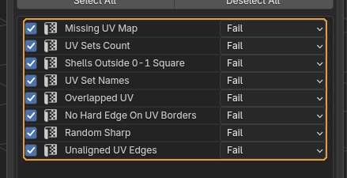{ .control-shot }

Галочка включает проверку, выпадающий список справа задаёт её уровень.

**Когда пригодится.** Уровень стоит менять чаще, чем выключать проверку. **Fail** блокирует сдачу, **Info** только сообщает. Если проверка в вашем пайплайне желательна, но не обязательна, переведите её в Info — так о ней хотя бы будет видно, а вердикт она не испортит.

!!! warning "Обратите внимание"
    Изменения относятся к текущей сцене. Чтобы они пережили файл, сохраните стадию.

### Описание и параметры проверки

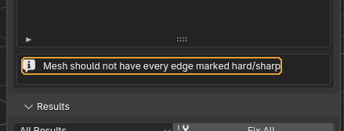{ .control-shot }

Коробка под списком: описание выбранной проверки и её настройки, если они у неё есть.

**Когда пригодится.** Сюда лезут, когда проверка ругается на то, что в вашем проекте нормально. Например, Object Name Pattern задаётся регулярным выражением — под своё именование меняется здесь.

!!! warning "Обратите внимание"
    У большинства проверок настроек нет, и коробка показывает только описание. Смысл параметров у каждой проверки свой — он указан в таблице ниже.

## Инструменты осмотра развёртки

Три интерактивных инструмента: они ничего не пишут в результаты, а показывают состояние прямо в редакторе UV. Все три смотрят на один текстурный сет за раз — на грани активного материала — и перенаводятся следом, когда вы меняете активный слот.

### Show Overlaps

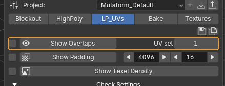{ .control-shot }

Подсвечивает в редакторе UV острова, налезающие друг на друга.

**Когда пригодится.** Когда проверка Overlapped UV сообщила о налезании, а найти его глазами не выходит. В списке результатов написано только «есть налезание» — а вот где именно, показывает этот инструмент.

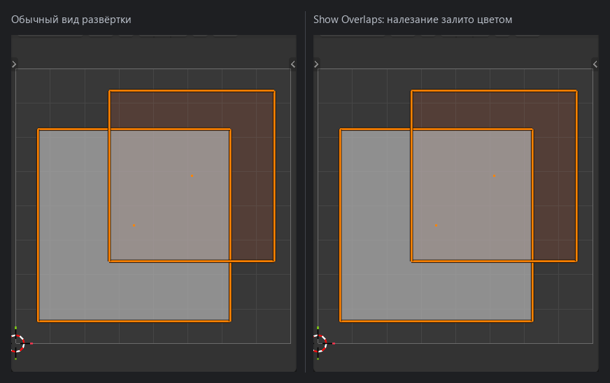{ .screenshot }

!!! warning "Обратите внимание"
    Галочка слева важнее, чем кажется. Без неё смотрится только активный объект; с ней — все видимые меши с тем же материалом, то есть всё, что попадёт в один атлас. Два объекта по отдельности могут быть чистыми и налезать друг на друга в общей развёртке — без этой галочки такое не находится. Смотрится один текстурный сет за раз: в счёт идут только грани активного материала, чужие острова рядом не показываются и налезанием не считаются. Переключите активный слот материала — осмотр перенаведётся на него на лету, выходить и заходить заново не нужно. Исключение — осмотр, открытый кликом по строке результата: он охватывает меш целиком, чтобы показанное совпало с тем, на что пожаловалась проверка. Активный слот такой осмотр не отслеживает. Поле UV set справа — номер набора, считая с единицы.

### Show Padding

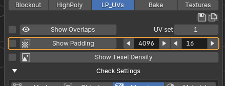{ .control-shot }

Показывает, во что превратятся отступы между островами при заданном размере текстуры.

**Когда пригодится.** До запекания, чтобы понять, не слипнутся ли соседние острова. Стрелками меняются два числа: слева размер текстуры, справа отступ в пикселях.

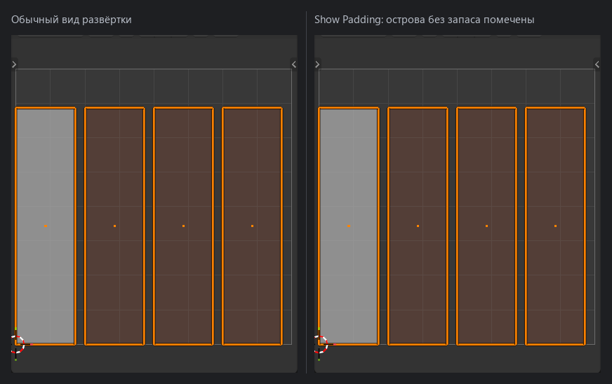{ .screenshot }

!!! warning "Обратите внимание"
    При смене размера текстуры отступ пересчитывается пропорционально — соотношение сохраняется, и не приходится пересчитывать в уме. Отступ меряется вокруг следа активного материала, а не вокруг меша: там, где его грани сходятся с гранями другого материала, проходит край острова. На мультиматериальной модели это и нужно — соседний материал уедет в свою текстуру и мешать не будет.

### Show Texel Density

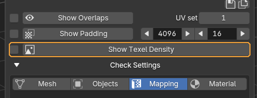{ .control-shot }

Красит объекты по плотности текселей.

**Когда пригодится.** Когда в сцене несколько ассетов и надо убедиться, что масштаб развёртки у них общий. Выбивающийся объект видно сразу по цвету — на текстуре это выглядело бы как разная чёткость деталей.

!!! warning "Обратите внимание"
    Цвет читается относительно средней плотности, а средняя считается только по граням активного материала. Второй материал на той же модели эталон на себя не тянет, так что сравнивать имеет смысл в пределах одного текстурного сета. Ровный цвет по всей модели означает, что по этому сету расхождений нет.

## Review Scene — материалы и клетка

Свиток свёрнут по умолчанию. Внутри — разбор материалов по сцене и шахматная текстура для оценки развёртки.

### Список материалов

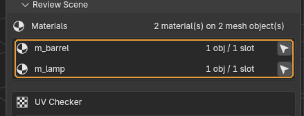{ .control-shot }

Все материалы в текущей области действия: сколько объектов и слотов использует каждый. У строки два действия — само имя материала и кнопка с иконкой развёртки справа.

**Когда пригодится.** Перед запеканием — понять, что попадёт в один атлас, и обойти материалы по очереди. **Клик по имени** выделяет объекты с этим материалом по всей сцене — не только те, что попали в Scope, чтобы забытый в стороне дубль не потерялся. Заодно у каждого выделенного этот материал становится активным слотом, а значит инструменты осмотра развёртки уже наведены на него. **Кнопка справа** — Review Material UVs. Она заводит многообъектный режим редактирования, в котором выделены только грани этого материала: в редакторе UV видно его развёртку и ничего лишнего. Повторное нажатие осмотр заканчивает.

**Что получится.** Пока осмотр идёт, кнопка вдавлена, а под списком стоит строка «Reviewing <имя материала>». Такая же появляется в панели Checklist — чтобы было видно, на что наведены оверлеи, даже когда список материалов свёрнут. По окончании возвращаются выделение, режим и синхронизация UV, ровно те, что были до начала. Переход с материала на материал этот снимок не сбрасывает: чтобы вернуться к своей работе, осмотр достаточно выключить один раз.

!!! warning "Обратите внимание"
    Список подчиняется выбранному Scope. С Selection он покажет материалы только выделенных объектов. Пока идёт осмотр, список нарочно продолжает показывать объекты, бывшие в области действия на его старте: иначе Selection схлопнулся бы на пользователей одного материала и перейти к следующему стало бы некуда. Скрытые и невыделяемые объекты пропускаются, их число аддон пишет в статусной строке. Материал, лежащий в слоте, но не назначенный ни одной грани, сообщит об этом отдельно и осмотр не начнёт.

### Checker Tiling

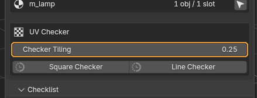{ .control-shot }

Плотность шахматной текстуры.

**Когда пригодится.** Крутится на лету, пока текстура включена. Мелкая клетка — точнее видно растяжение, крупная — понятнее общий масштаб.

**По умолчанию:** 0.25

### Square Checker / Line Checker

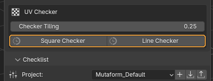{ .control-shot }

Натягивают на все материалы проверочную текстуру: клетку или полосы.

**Когда пригодится.** Клетка показывает растяжение и масштаб, полосы — направление развёртки и скосы. Повторное нажатие снимает текстуру.

!!! warning "Обратите внимание"
    Исходные материалы не портятся: аддон запоминает их и возвращает при выключении. Но не сохраняйте файл с включённой проверочной текстурой — велик шанс забыть и отдать ассет в таком виде.

## Все проверки

Подписи и признак автофикса взяты прямо из аддона, поэтому таблица не может разойтись с тем, что вы видите в панели. «Меняет геометрию» означает, что фикс правит модель, а не просто помечает проблему.

### Геометрия

| Проверка | Что ищет | Автофикс |
| --- | --- | --- |
| **Too Much Hard Edge** | Ловит меш, у которого жёсткими помечены вообще все рёбра. Обычно это след импорта или случайного Shade Flat на всю модель. | да |
| **N-Gons** | Полигоны больше чем из четырёх вершин. Фикс триангулирует их. | да, меняет геометрию |
| **Non-Manifold Geometry** | Некорректная топология: рёбра с тремя и более гранями, вывернутые вееры, дыры в объёме. Фикс режет вееры и заваривает вершины только внутри каждой отдельной детали, поэтому соседние детали не слипаются. | да |
| **Zero Area Faces** | Вырожденные грани — площадь меньше допуска. | да, меняет геометрию |
| **Zero Length Edges** | Рёбра короче допуска, обычно сдвоенные вершины. | да, меняет геометрию |
| **Non-Planar Faces** | Четырёхугольники, вершины которых не лежат в одной плоскости. В движке такая грань разобьётся на треугольники непредсказуемо. | да, меняет геометрию |
| **Concave Faces** | Полигоны с вогнутым углом. | да, меняет геометрию |
| **Duplicate Faces** | Две грани на одном и том же наборе вершин. | да, меняет геометрию |
| **Loose Geometry** | Вершины и рёбра, не входящие ни в одну грань. При экспорте теряются или дают мусор. | да, меняет геометрию |
| **Animation Keys** | На объекте, меше или ключах формы осталась анимация — для статичного ассета это лишние данные в FBX. | да |

### Трансформации

| Проверка | Что ищет | Автофикс |
| --- | --- | --- |
| **Unapplied Transform** | Положение, поворот или масштаб отличаются от исходных. Фикс применяет трансформацию, то есть меняет координаты вершин. | да, меняет геометрию |
| **Pivot Not At World Origin** | Начало координат объекта не в нуле мира. | да |
| **Pivot Not Centered** | Начало координат не в центре габаритов. Автофикса нет намеренно: правильное место пивота зависит от того, как ассет ставится в уровне. | нет |

### UV

| Проверка | Что ищет | Автофикс |
| --- | --- | --- |
| **Missing UV Map** | У меша нет ни одного UV-набора. | нет |
| **UV Sets Count** | UV-наборов больше, чем разрешено параметром. | нет |
| **Shells Outside 0-1 Square** | Острова вылезли за первый квадрат 0-1. Для обычного ассета это ошибка, для UDIM-пайплайна проверку выключают. | нет |
| **UV Set Names** | Блендеровские `UVMap` заменяются на `map1`, `map2` — так их ожидает Maya и часть движков. | да |
| **Overlapped UV** | Налезающие друг на друга UV. Найденное разворачивается до целых островов, чтобы выделение было осмысленным. | да |
| **Padding** | Не проверка, а интерактивный предпросмотр отступов. В результаты ничего не пишет и в списке чек-листа не показывается. | нет |
| **No Hard Edge On UV Borders** | Каждое ребро на границе острова должно быть жёстким. Иначе по шву на запечённой нормали пойдёт градиент. | да |
| **Random Sharp** | Обратная проверка: жёсткие рёбра без границы развёртки под ними. Такое ребро создаёт лишний шов в нормалях. | да |
| **Unaligned UV Edges** | Границы островов, отклонившиеся от осей на доли градуса, у в остальном прямоугольных развёрток. На глаз незаметно, а текстура по такому краю получается рваной. | да |

### Именование

| Проверка | Что ищет | Автофикс |
| --- | --- | --- |
| **Object Name Pattern** | Имя объекта должно совпадать с регулярным выражением. | да |

### Материалы

| Проверка | Что ищет | Автофикс |
| --- | --- | --- |
| **Missing Material** | У объекта или части его граней не назначен материал. | нет |
| **Material Count** | Материалов на одном меше больше, чем разрешено. | нет |
| **Material Name** | Имена материалов должны совпадать с шаблоном. | да |

### Nanite

| Проверка | Что ищет | Автофикс |
| --- | --- | --- |
| **Nanite Closed Geometry** | Открытая оболочка должна быть утоплена в соседнюю геометрию. Ловит накладки, висящие в воздухе, и те, что дотянулись до поверхности не целиком: в Unreal на таком месте Nanite покажет дыру. | нет |

## Как это выглядит на модели

Слева — что подсвечивается, когда нажимаешь на строку результата. Справа — что осталось после Fix Me. Все кадры сняты настоящим прогоном валидатора на специально сломанной геометрии.

### N-Gons

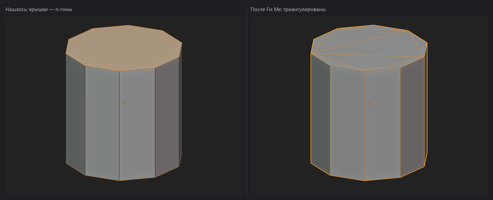{ .screenshot }

Крышки цилиндра — полигоны из десяти вершин. Автофикс триангулирует их; боковые четырёхугольники не трогает.

### Loose Geometry

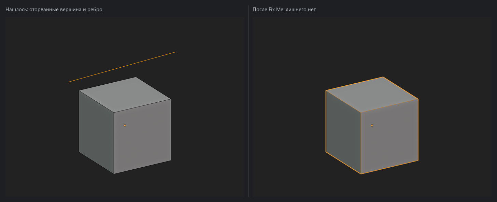{ .screenshot }

Вершина и ребро, не входящие ни в одну грань. В сцене их не видно — пока не включишь каркас или не нажмёшь на строку результата.

### Non-Manifold Geometry

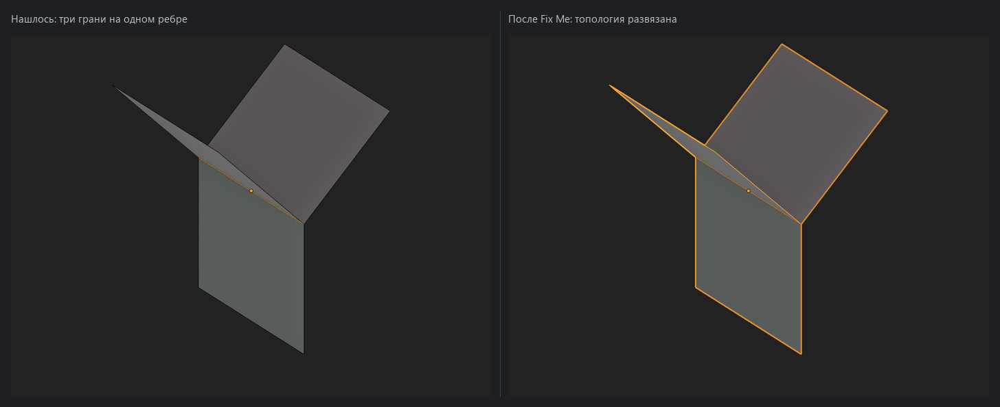{ .screenshot }

Три грани, сходящиеся на одном ребре. Подсвечено именно ребро — по нему сразу понятно, где деталь собрана неправильно.

### Concave Faces

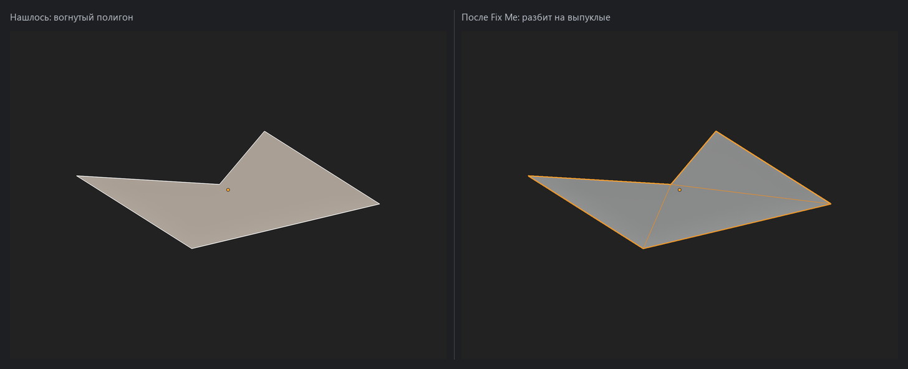{ .screenshot }

Полигон с вогнутым углом. Фикс разбивает его на выпуклые.

### Non-Planar Faces

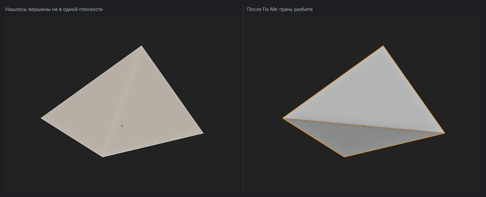{ .screenshot }

Четырёхугольник, у которого одна вершина поднята над плоскостью остальных. Фикс разбивает грань, чтобы движку нечего было додумывать.

### Zero Area Faces

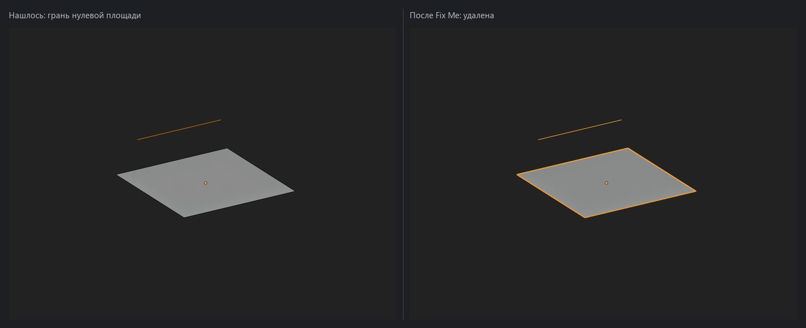{ .screenshot }

Грань нулевой площади: две её вершины лежат в одной точке. На модели такая грань не видна вовсе, а в экспорте даёт мусор.

### Zero Length Edges

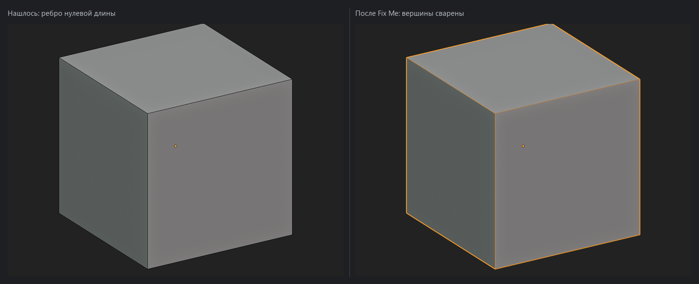{ .screenshot }

Ребро между двумя совпадающими вершинами. Фикс сваривает их.

### Duplicate Faces

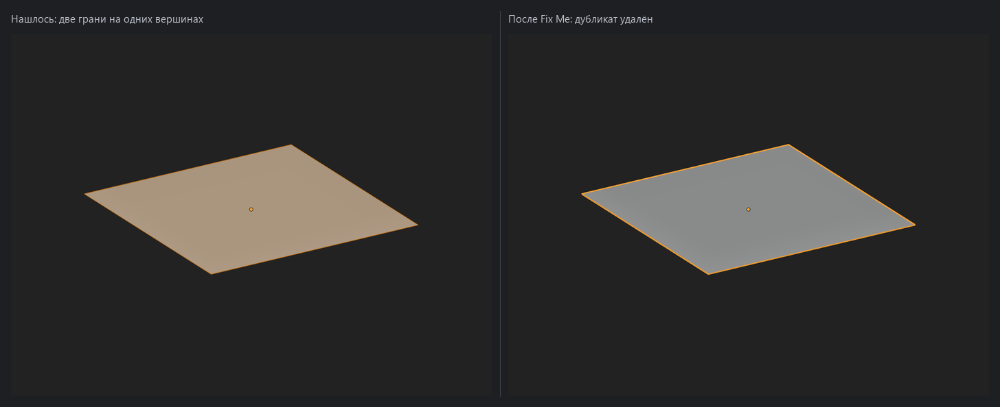{ .screenshot }

Две грани на одном и том же наборе вершин. Внешне модель выглядит нормально, а при запекании такие грани дерутся за одни и те же тексели.

### Too Much Hard Edge

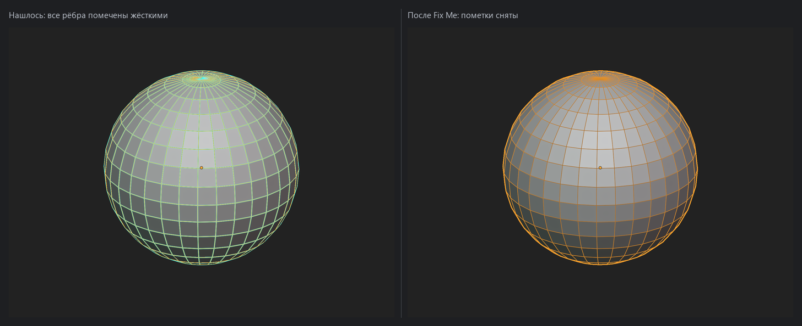{ .screenshot }

Сфера, у которой жёсткими помечены все рёбра до единого. Фикс снимает пометки, и сглаживание возвращается.

### Pivot Not Centered

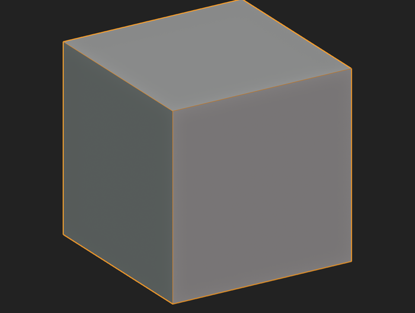{ .screenshot }

Начало координат объекта стоит в стороне от геометрии. Автофикса нет намеренно: куда должен смотреть пивот, зависит от того, как ассет ставится в уровне, и угадывать за художника аддон не берётся.

### Show Overlaps

{ .screenshot }

Слева обычный вид развёртки: налезание есть, но глазом его не поймать. Справа включён Show Overlaps — пересечение залито цветом.

### Show Padding

{ .screenshot }

Справа помечены острова, у которых при заданном размере текстуры не хватает запаса до соседей. При запекании такие острова потекут друг в друга.

### Nanite Closed Geometry

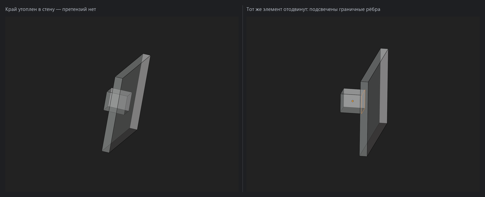{ .screenshot }

Слева накладка утоплена в стену: её открытый край оказался внутри соседней геометрии, и претензий нет. Справа тот же элемент отодвинут — край повис в воздухе, и проверка подсветила граничные рёбра. Сообщение бывает двух видов. «Sealed by nothing» — оболочку не закрывает ничто, как на правом кадре. «Not fully embedded» — край дотянулся не весь, и рядом указан самый большой зазор в миллиметрах; так бывает у наклонённой накладки, у которой один угол вышел наружу. Автофикса нет: подвинуть или дотянуть геометрию может только человек.

---

*Страница собрана из файла `content/qc-validator.ru.yml`. Снимки сделаны в **Scene QC Validator by Mutaform Studio 1.9.2**.*
